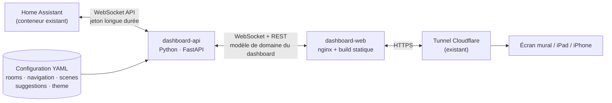

# Cahier des charges — Dashboard sur-mesure Villa Bulle

Document vivant, tenu à jour par Claude au fil des décisions. Référence structurelle versionnée dans le repo — complète `custom_dashboard.md` (mémoire projet côté Claude), qui garde l'historique des itérations visuelles.

**Statut : v3 (03.09.2026)**, mise à jour le 03.09.2026 (backend confirmé en Python) — réécriture complète sur retour explicite de l'utilisateur : la v2 ("simulation") manquait de structure et d'exigences précises. Ce document couvre : les exigences fonctionnelles écran par écran, les maquettes visuelles livrées, l'architecture logicielle (proposition technique de Claude pour découpler le dashboard de Home Assistant), et le modèle de configuration.

## Sommaire

1. Objectifs et principes directeurs
2. Périmètre et contraintes
3. Exigences fonctionnelles par écran
4. Architecture logicielle
5. Modèle de configuration — ce qui doit être configurable
6. Système visuel
7. Maquettes visuelles livrées
8. Hors scope actuel
9. Feuille de route proposée
10. Points ouverts

---

## 1. Objectifs et principes directeurs

- Dashboard domotique sur-mesure pour la Villa Bulle, codé de A à Z, en projet parallèle à Tunet (qui reste la solution active au quotidien jusqu'à bascule complète).
- Quatre principes non négociables pour la suite du projet :
  1. **Modulaire** : ajouter une pièce, un écran ou une section ne doit jamais nécessiter de modifier le code des sections existantes.
  2. **Découplé de Home Assistant** : aucune partie de l'interface ne doit connaître un `entity_id` HA en dur. Si une entité est renommée côté HA (déjà arrivé sur ce projet), seule la configuration doit changer.
  3. **Configurable sans redéploiement de code** : pièces, navigation, scènes, seuils d'alerte doivent vivre dans des fichiers de configuration versionnés, pas dans le code applicatif.
  4. **Évolutif indépendamment** : le dashboard doit pouvoir sortir une nouvelle version sans toucher à Home Assistant, et Home Assistant doit pouvoir évoluer (entités, intégrations) sans casser le dashboard tant que la configuration est mise à jour.

## 2. Périmètre et contraintes

- **Appareils cibles** : écran mural tactile (référence), iPad/tablette, iPhone — un seul jeu de composants, breakpoints CSS. Mac hors périmètre pour l'instant (point ouvert, §10).
- **Contrainte d'hébergement** : suit le pattern déjà établi sur ce projet (services Docker indépendants sur `domotique_net`, exposition via le tunnel Cloudflare existant, un sous-domaine `*.malnoy.com` à un seul niveau).
- **Contrainte d'équipe** : Claude écrit le code, la configuration et les fichiers Docker ; l'utilisateur exécute `docker compose up`, gère les jetons d'accès HA et les réglages Cloudflare — même répartition que pour `doc-knx` et l'intégration Tesla.
- **Contrainte de données** : au lancement, aucune donnée réelle n'est branchée — le backend décrit en §4 doit fonctionner aussi bien avec des données de démonstration (mode `mock`) qu'avec une vraie instance HA, pour permettre de continuer à itérer visuellement avant le branchement réel.

## 3. Exigences fonctionnelles par écran

Chaque ligne est une exigence vérifiable. `Source` renvoie au domaine de données du modèle de configuration (§5), pas à un entity_id HA — c'est tout le sens du découplage (§4).

### 3.1 Transversal (tous les écrans)

| ID | Exigence | Détail | États / cas limites |
|---|---|---|---|
| T1 | Navigation persistante | Un point d'accès constant vers les sections de premier niveau, quel que soit l'écran affiché. | Doit rester utilisable si une section n'a pas encore de données (mode maquette). |
| T2 | Réactivité multi-appareil | Même configuration et mêmes données, layout recalculé selon la largeur (écran mural / tablette / mobile). | Bascule de layout sans perte d'état (ex. volet ouvert dans une pièce reste ouvert après rotation). |
| T3 | Résilience à la perte de connexion HA | Si le backend perd la connexion WebSocket à HA, le dashboard affiche un état "dernière donnée connue" horodaté plutôt qu'un écran vide ou une erreur brute. | Reconnexion automatique en arrière-plan, sans intervention utilisateur. |
| T4 | Accessibilité mouvement | Toute animation (scroll, volet, respiration, veille) respecte `prefers-reduced-motion` : saut direct à l'état final. | — |
| T5 | Mode veille ambiant | Après une période d'inactivité configurable, affichage minimal (horloge + météo). Toucher l'écran restaure la vue précédente. | Ne doit jamais couper l'alimentation ni fermer l'app — c'est un habillage visuel, pas une mise en veille système. |
| T6 | Suggestions contextuelles | Bandeau non intrusif proposant une action selon une règle configurée (ex. météo + présence + volet). Jamais d'action automatique sans confirmation explicite. | Une suggestion ignorée ne doit pas se réafficher en boucle dans la même session. |

### 3.2 Accueil (Maison)

| ID | Exigence | Détail | Source |
|---|---|---|---|
| A1 | Heure et date en direct | Horloge lisible à distance (écran mural), mise à jour sans rechargement de page. | horloge système |
| A2 | Résumé météo courant | Température, description courte. | `weather` |
| A3 | Accès rapide aux scènes | Liste de scènes configurées (ex. Mode nuit, Je pars), déclenchables en un geste. | `scenes` |
| A4 | Salutation contextuelle | Message d'accueil qui peut varier selon l'heure ou un événement notable (ex. pièce ensoleillée et vide). | dérivé de `rooms` + `weather` |

### 3.3 Vue d'étage / RDC

| ID | Exigence | Détail | Source |
|---|---|---|---|
| E1 | Grille des pièces de l'étage | Une tuile par pièce configurée pour cet étage. | `rooms` (filtré par `floor`) |
| E2 | État résumé par tuile | Au minimum : température actuelle, indicateur lumière allumée/éteinte, position du volet. | `rooms[].sensors`, `rooms[].lights`, `rooms[].covers` |
| E3 | Entrée dans une pièce | Toucher une tuile ouvre la vue détaillée de la pièce (transition selon le concept de navigation retenu, §7). | — |
| E4 | Pièce sans donnée réelle | Une pièce présente dans la configuration mais sans entités mappées s'affiche en mode "maquette" explicite plutôt que masquée ou vide. | — |

### 3.4 Vue pièce (ex. Chambre Léane)

| ID | Exigence | Détail | Source |
|---|---|---|---|
| P1 | Température actuelle et consigne | Lecture + réglage si un `climate` est mappé. | `rooms[].climate` |
| P2 | Contrôle des lumières | Basculer chaque lumière de la pièce ; l'effet `.light-fx` (assombrissement/éclairage du fond) reflète l'état réel agrégé. | `rooms[].lights` |
| P3 | Contrôle du volet, piloté en pourcentage | Curseur 0-100 %, pas seulement ouvert/fermé binaire ; anime les lattes, l'ombre au sol et la lumière ambiante proportionnellement (détail technique déjà validé, voir `custom_dashboard.md` §"Effet volet"). | `rooms[].covers` |
| P4 | Effet chauffage au sol | Glow animé en continu tant que le mode confort est actif (déjà implémenté et validé visuellement). | `rooms[].climate` |
| P5 | Choix de représentation | Bascule Iso / Photo quand une photo réelle existe pour la pièce. | `rooms[].photo` (optionnel) |
| P6 | Pièce sans photo réelle | Repli automatique et silencieux sur la vue isométrique (SVG paramétrique générique) si aucune photo n'est fournie. | — |

### 3.5 Extérieur

| ID | Exigence | Détail | Source |
|---|---|---|---|
| X1 | Contenu à définir avec l'utilisateur | Terrasse, éclairage extérieur, volets, piscine, jardin — liste exacte non tranchée (point ouvert §10). | `rooms` (floor = extérieur) |

### 3.6 Fonctions (scènes & actions rapides)

| ID | Exigence | Détail | Source |
|---|---|---|---|
| F1 | Liste des scènes/actions transversales | Grille d'actions rapides configurées (ex. "Tout éteindre", "Mode absence"). | `scenes` |
| F2 | Confirmation pour les actions sensibles | Une action marquée `confirm: true` dans la configuration demande une validation avant exécution. | `scenes[].confirm` |

### 3.7 Système — Énergie / Solaire

| ID | Exigence | Détail | Source |
|---|---|---|---|
| S1 | Production solaire instantanée | Valeur en kW, mise à jour en direct. | `energy.production` |
| S2 | État de la batterie | Pourcentage + indicateur charge/décharge. | `energy.battery` |
| S3 | Consommation instantanée | Valeur en kW. | `energy.consumption` |
| S4 | Renvoi vers Grafana | Le détail historique (courbes) n'est pas dupliqué ici — un lien ouvre le dashboard Grafana existant. | config statique (URL) |

### 3.8 Système — Tesla

| ID | Exigence | Détail | Source |
|---|---|---|---|
| S5 | État de charge et autonomie | Pourcentage batterie, autonomie estimée. | `tesla.battery`, `tesla.range` |
| S6 | Présence du véhicule | À la maison / en déplacement (+ ETA si disponible). | `tesla.location` |
| S7 | Module désactivable | Si l'intégration Tesla Fleet API n'est pas encore active, le module s'efface proprement (pas d'erreur visible) plutôt que d'afficher des données factices comme réelles. | feature flag `tesla.enabled` |

### 3.9 Système — Sécurité / Caméras

| ID | Exigence | Détail | Source |
|---|---|---|---|
| S8 | Statut portes/fenêtres | Liste des ouvrants avec état. | `security.openings` |
| S9 | Module en mode maquette | Aucun matériel installé à ce jour — le module doit être clairement marqué "à venir" plutôt que de simuler des données comme si elles étaient réelles. | feature flag `security.enabled=false` |

### 3.10 Système — Météo

| ID | Exigence | Détail | Source |
|---|---|---|---|
| S10 | Conditions actuelles et prévisions courtes | Température, description, prévision J+1/J+2. | `weather` |

## 4. Architecture logicielle

### 4.1 Le problème à résoudre

Le prototype actuel (les Artifacts) code les données et les identifiants d'entités en dur dans le HTML. C'est correct pour explorer une direction visuelle, mais ça viole les quatre principes du §1 : impossible à faire évoluer sans tout réécrire, aucune séparation entre "ce que HA expose" et "ce que le dashboard affiche". La demande explicite de l'utilisateur est de proposer une vraie architecture logicielle pour que **Home Assistant et le dashboard puissent évoluer indépendamment l'un de l'autre**.

### 4.2 Proposition — architecture à trois couches

**Couche 1 — Home Assistant.** Inchangée. Reste la source de vérité pour les entités KNX, capteurs, scènes existantes.

**Couche 2 — `dashboard-api` (nouveau service, à créer).** Un petit service **Python (FastAPI, `asyncio`)** qui :
- se connecte à HA en WebSocket (authentification par jeton longue durée, `subscribe_events`, `call_service`) — le protocole est documenté et assez simple pour être implémenté directement avec `websockets`/`aiohttp`, en s'appuyant sur la logique de reconnexion et d'authentification de `home-assistant-js-websocket` (la librairie officielle JS) comme référence de conception ;
- lit la configuration YAML (§5) pour savoir quels `entity_id` correspondent à quelle pièce, quel capteur, quelle scène ;
- traduit les états HA bruts vers un **modèle de domaine propre au dashboard** (`Room`, `Device`, `Scene`, `EnergyReading`, …, modélisé en Pydantic) — c'est ici, et seulement ici, que vit la connaissance de Home Assistant ;
- pousse les mises à jour en temps réel au frontend (WebSocket natif FastAPI), et expose une API REST pour les actions ponctuelles (changer une scène, régler un volet) et pour la configuration au démarrage ;
- porte le moteur de suggestions contextuelles (T6) — c'est de la logique serveur, pas de l'UI.

**Python confirmé le 03.09.2026** (décision de l'utilisateur, après comparatif détaillé avec Node.js) : le principal atout de Node.js — la librairie officielle `home-assistant-js-websocket` — ne compense pas, pour un projet de cette taille, l'avantage de garder **un seul langage sur l'ensemble du projet** (les scripts KNX existants sont déjà en Python) : un seul écosystème de dépendances à suivre, une seule famille d'image Docker, moins de contexte à réapprendre d'une session à l'autre. Le protocole WebSocket de HA reste assez simple pour être porté proprement en Python, et FastAPI apporte des équivalents modernes (WebSocket natif, modèles Pydantic, documentation d'API générée) à ce que Node aurait apporté.

**Couche 3 — `dashboard-web` (nouveau service, à créer).** Une interface **Vue 3** (build via Vite, sortie en fichiers statiques servis par nginx — même schéma que `doc-knx`). Chaque section du dashboard (Maison, Étage, Pièce, Énergie, Tesla, Sécurité, Météo, Fonctions) est un **module Vue indépendant**, enregistré dans un petit registre de sections piloté par `navigation.yaml`. Ajouter une section = ajouter un composant + une entrée de configuration, sans toucher aux sections existantes — c'est ce qui rend le dashboard modulaire au sens du §1.

**Pourquoi un framework (Vue) plutôt que du JavaScript "vanilla"** comme dans les maquettes actuelles : les maquettes sont volontairement jetables pour comparer des directions visuelles. Un dashboard destiné à vivre plusieurs années et à recevoir de nouvelles sections a besoin d'un modèle de composants avec liaison de données déclarative (un volet à 35 % doit se refléter automatiquement dans l'UI sans code de synchronisation manuel écrit à la main pour chaque nouvel écran) — c'est exactement ce qu'apporte un framework réactif, au prix d'une étape de build (déjà acceptée ailleurs dans le projet, ex. les scripts de génération de rapport KNX).

### 4.3 Déploiement Docker

Deux nouveaux services dans `docker-compose.yml`, sur `domotique_net`, suivant la convention déjà en place (un dossier `<Service>_Data` par service, `.env` pour les secrets) :

- **`dashboard-api`** : construit depuis `dashboard/api/`, lit `dashboard/config/*.yaml` (monté en lecture seule), lit le jeton HA longue durée depuis `.env` (jamais exposé au navigateur), port interne uniquement.
- **`dashboard-web`** : nginx servant le build Vite de `dashboard/web/`, proxy `/api` et `/ws` vers `dashboard-api` en interne, seul point d'entrée exposé au tunnel Cloudflare — un nouveau sous-domaine à un seul niveau (ex. `dashboardbulle.malnoy.com`, à confirmer avec l'utilisateur) suivrait exactement la procédure déjà rodée pour `doc-knx` et `visubulle`.

Le jeton HA (Long-Lived Access Token) reste une étape manuelle utilisateur, comme pour toute intégration précédente sur ce projet — jamais généré ni stocké par Claude.

### 4.4 Ce que ça permet concrètement

- Renommer un entity_id dans HA → une ligne à changer dans `rooms.yaml`, zéro ligne de code touchée.
- Ajouter la pièce "Buanderie" → une entrée dans `rooms.yaml`, aucune modification du composant Vue de la vue d'étage.
- Changer complètement de modèle de navigation (v1 / Concept A / Concept B, §7) → ça touche uniquement `dashboard-web`, `dashboard-api` et la configuration ne bougent pas.
- Faire évoluer Home Assistant (nouvelle intégration, migration de version) → tant que les entités mappées dans la configuration restent valides, le dashboard continue de fonctionner sans modification.

## 5. Modèle de configuration — ce qui doit être configurable

Fichiers YAML versionnés dans `dashboard/config/`, dans le même esprit que le fichier de configuration KNX déjà maintenu par Claude pour ce projet.

| Fichier | Contenu | Exemple de clés |
|---|---|---|
| `rooms.yaml` | Toutes les pièces, leur étage, les entités HA associées, leur art visuel. | `id, name, floor, order, lights[], covers[], climate, sensors[], photo?` |
| `navigation.yaml` | Structure de la navigation : sections de premier niveau, ordre, icônes, quel composant afficher. | `sections[].id, label, icon, component, order` |
| `scenes.yaml` | Scènes et actions rapides, avec confirmation optionnelle. | `id, label, icon, service_call, confirm` |
| `suggestions.yaml` | Règles des suggestions contextuelles (condition → message → action proposée). | `id, condition, message, action, enabled` |
| `theme.yaml` | Jetons visuels (palette, typographies) — déjà figés aujourd'hui mais externalisés pour rester modifiables sans toucher au code. | `colors{}, fonts{}` |
| `features.yaml` | Interrupteurs de fonctionnalités pour les modules pas encore prêts (Sécurité, Tesla). | `tesla.enabled, security.enabled` |
| `.env` (non versionné) | Jeton HA longue durée, URL de l'instance HA. | `HA_URL, HA_TOKEN` |

Principe : **toute donnée qui décrit "notre maison" (quelles pièces, quelles entités, quelles scènes) vit en configuration, jamais dans le code.** Le code ne décrit que "comment afficher une pièce en général", pas "ce qu'est la Chambre Léane".

## 6. Système visuel

Palette : Nuit `#0b0e16`, Brume `#eef1f6`, Ambre `#ff9c54`, Glacier `#5ac8fa`, Mousse `#6fcf97`, Cuivre `#caa06b`. Typo : Fraunces (affichage) / Inter (interface) / IBM Plex Mono (données). Thème sombre unique assumé. Détail des effets déjà validés (chauffage au sol, éclairage de pièce) dans `custom_dashboard.md`.

## 7. Maquettes visuelles livrées

Trois prototypes Artifact existent à ce jour, chacun avec un rôle différent :

- **Prototype v1 "Bulle Console"** — direction visuelle et système de composants déjà validés par l'utilisateur (nav gauche + swipe, effet chauffage au sol). URL : `https://claude.ai/code/artifact/3cbd1c1d-9a57-4394-bf2a-d8827d42ea2b`.
- **Concept A "Strates"** — exploration d'une navigation spatiale par scroll vertical continu (parallax, zoom-through, rail d'ascenseur), avec démonstration de l'effet volet piloté par pourcentage. URL : `https://claude.ai/code/artifact/e6922690-86d0-45c5-8bff-8646e66c2726`.
- **Concept B "Respiration"** — exploration d'un hub ambiant façon magazine (cartes contextuelles, pièces qui "respirent", panneau coulissant, dock bas), pensé mobile-first. URL : `https://claude.ai/code/artifact/abfd1791-c389-4419-a71f-e0efc2f63d5d`.

Ces trois maquettes sont volontairement des simulations en données statiques — leur rôle est de trancher la direction de navigation (§10, point 1) avant de porter le résultat dans l'architecture modulaire du §4. Une fois la direction choisie, chaque écran listé au §3 sera repris comme composant Vue réel, alimenté par `dashboard-api`.

## 8. Hors scope actuel

- Matériel sécurité/caméras (pas installé) → module désactivé par défaut (`features.yaml`).
- Photos réelles des pièces autres que Chambre Léane (pas encore fournies).
- Authentification/gestion multi-utilisateurs sur le dashboard (à évaluer si l'accès dépasse le réseau local + tunnel).
- Retour haptique/sonore sur les volets.

## 9. Feuille de route proposée

1. Trancher le modèle de navigation (§10.1) à partir des maquettes existantes.
2. Écrire le squelette `dashboard-api` (connexion HA en mode `mock` d'abord, sans jeton réel) + `dashboard-web` (structure Vue/Vite, sans design final) — poser l'architecture avant de porter le visuel.
3. Porter les écrans validés (§3) comme composants Vue, alimentés par les données `mock` de `dashboard-api`.
4. Écrire `rooms.yaml` avec les vraies pièces et, une fois le jeton HA fourni par l'utilisateur, brancher `dashboard-api` en mode réel.
5. Ajouter les services Docker à `docker-compose.yml`, déploiement par l'utilisateur, exposition Cloudflare.

## 10. Points ouverts à trancher ensemble

1. Quel modèle de navigation entre v1, Concept A et Concept B (ou une synthèse des trois) ?
2. Contenu précis de l'écran **Extérieur** (§3.5).
3. Le **Mac** doit-il être un format cible ?
4. Contenu de l'écran **Fonctions** : quelles scènes/actions prioritaires (§3.6) ?
5. Nom du futur sous-domaine Cloudflare pour le dashboard (ex. `dashboardbulle.malnoy.com`) ?
6. Les suggestions contextuelles et le mode veille ambiant (§3.1, T5/T6) sont-ils souhaités tels quels ?

*(Point résolu le 03.09.2026 : `dashboard-api` sera en Python/FastAPI, voir §4.2.)*
