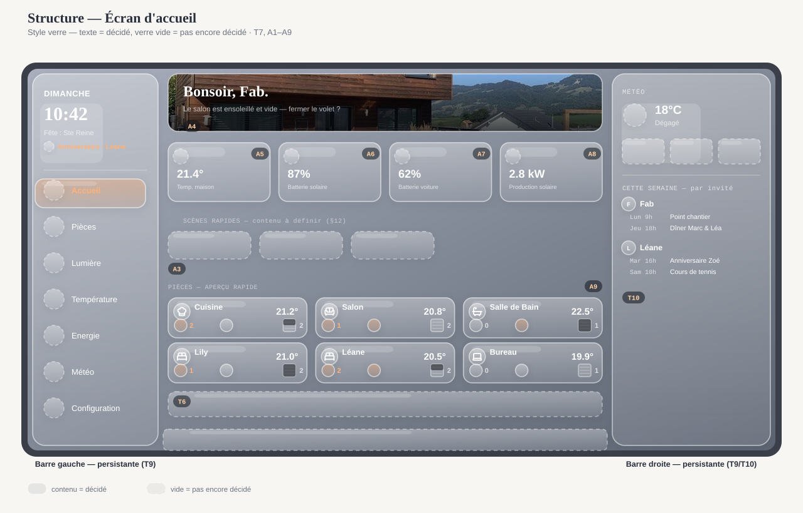
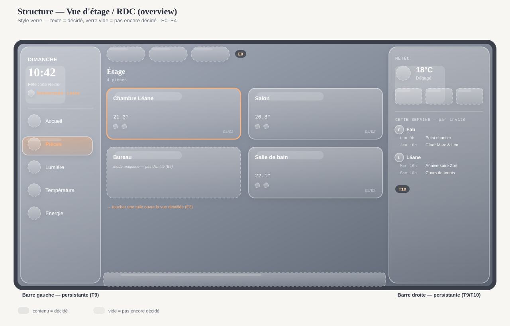
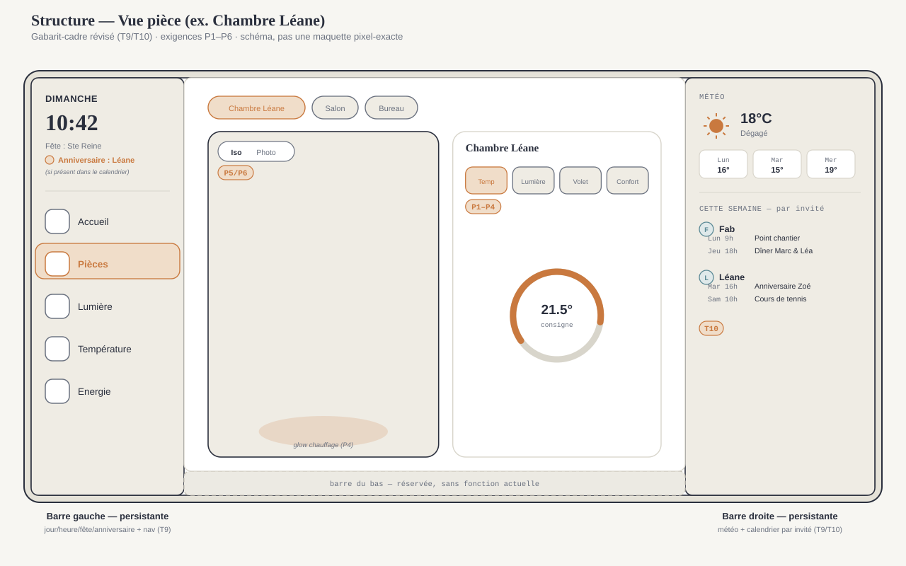
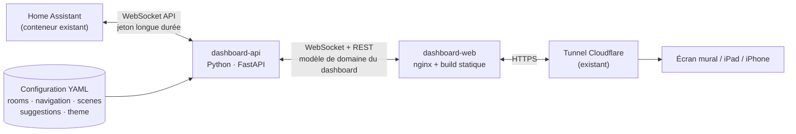

# Cahier des charges — Dashboard sur-mesure Villa Bulle

Document vivant, tenu à jour par Claude au fil des décisions. Référence structurelle versionnée dans le repo — complète `custom_dashboard.md` (mémoire projet côté Claude), qui garde l'historique des itérations visuelles.

**Statut : v3 (06.09.2026)**, mise à jour le 06.09.2026 — réécriture complète sur retour explicite de l'utilisateur (la v2 "simulation" manquait de structure et d'exigences précises), backend confirmé en Python (§4.2), chapitres Sécurité (§5) et Stratégie de test (§6) ajoutés, gabarit de navigation retenu via la maquette "Boussole" (§9), accès depuis internet et alignement Mac précisés (§1, §2), sketches de structure ajoutés pour les écrans Accueil/Étage-RDC/Pièce (§3.2-3.4), gabarit-cadre révisé avec barres latérales gauche/droite persistantes (jour/heure/fête/anniversaire/navigation à gauche, météo/calendrier par invité à droite — T9/T10), nouvelles exigences A5-A8 (températures, batteries solaire/voiture, production solaire sur l'accueil), navigation gauche portée à 7 entrées (Configuration puis Météo ajoutées), bibliothèque de médias `assets/photos-images-icons` définie (§7.1). Ce document couvre : les exigences fonctionnelles écran par écran, les maquettes visuelles livrées, l'architecture logicielle (proposition technique de Claude pour découpler le dashboard de Home Assistant), le modèle de configuration, la sécurité et la stratégie de test.

## Sommaire

1. Objectifs et principes directeurs
2. Périmètre et contraintes
3. Exigences fonctionnelles par écran
4. Architecture logicielle
5. Sécurité et gestion des accès
6. Stratégie de test et de vérification
7. Modèle de configuration — ce qui doit être configurable
8. Système visuel
9. Maquettes visuelles livrées
10. Hors scope actuel
11. Feuille de route proposée
12. Points ouverts

---

## 1. Objectifs et principes directeurs

- Dashboard domotique sur-mesure pour la Villa Bulle, codé de A à Z, en projet parallèle à Tunet (qui reste la solution active au quotidien jusqu'à bascule complète).
- Accessible depuis internet, pas seulement sur le réseau local de la villa — via le tunnel Cloudflare déjà en place (§2), au même titre que `docbulle.malnoy.com` aujourd'hui.
- Quatre principes non négociables pour la suite du projet :
  1. **Modulaire** : ajouter une pièce, un écran ou une section ne doit jamais nécessiter de modifier le code des sections existantes.
  2. **Découplé de Home Assistant** : aucune partie de l'interface ne doit connaître un `entity_id` HA en dur. Si une entité est renommée côté HA (déjà arrivé sur ce projet), seule la configuration doit changer.
  3. **Configurable sans redéploiement de code** : pièces, navigation, scènes, seuils d'alerte doivent vivre dans des fichiers de configuration versionnés, pas dans le code applicatif.
  4. **Évolutif indépendamment** : le dashboard doit pouvoir sortir une nouvelle version sans toucher à Home Assistant, et Home Assistant doit pouvoir évoluer (entités, intégrations) sans casser le dashboard tant que la configuration est mise à jour.

## 2. Périmètre et contraintes

- **Appareils cibles** : écran mural tactile (référence), iPad/tablette, iPhone, Mac — un seul jeu de composants, breakpoints CSS. Le Mac utilise la même configuration tactile que l'écran mural : pas de version dédiée (résolu le 03.09.2026).
- **Contrainte d'hébergement** : suit le pattern déjà établi sur ce projet (services Docker indépendants sur `domotique_net`, exposition via le tunnel Cloudflare existant, un sous-domaine `*.malnoy.com` à un seul niveau).
- **Contrainte d'équipe** : Claude écrit le code, la configuration et les fichiers Docker ; l'utilisateur exécute `docker compose up`, gère les jetons d'accès HA et les réglages Cloudflare — même répartition que pour `doc-knx` et l'intégration Tesla.
- **Contrainte de données** : au lancement, aucune donnée réelle n'est branchée — le backend décrit en §4 doit fonctionner aussi bien avec des données de démonstration (mode `mock`) qu'avec une vraie instance HA, pour permettre de continuer à itérer visuellement avant le branchement réel.

## 3. Exigences fonctionnelles par écran

Chaque ligne est une exigence vérifiable. `Source` renvoie au domaine de données du modèle de configuration (§7), pas à un entity_id HA — c'est tout le sens du découplage (§4).

### 3.1 Transversal (tous les écrans)

| ID | Exigence | Détail | États / cas limites |
|---|---|---|---|
| T1 | Navigation persistante | Un point d'accès constant vers les sections de premier niveau, quel que soit l'écran affiché. | Doit rester utilisable si une section n'a pas encore de données (mode maquette). |
| T2 | Réactivité multi-appareil | Même configuration et mêmes données, layout recalculé selon la largeur (écran mural / tablette / mobile). | Bascule de layout sans perte d'état (ex. volet ouvert dans une pièce reste ouvert après rotation). |
| T3 | Résilience à la perte de connexion HA | Si le backend perd la connexion WebSocket à HA, le dashboard affiche un état "dernière donnée connue" horodaté plutôt qu'un écran vide ou une erreur brute. | Reconnexion automatique en arrière-plan, sans intervention utilisateur. |
| T4 | Accessibilité mouvement | Toute animation (scroll, volet, respiration, veille) respecte `prefers-reduced-motion` : saut direct à l'état final. | — |
| T5 | Mode veille ambiant | Après une période d'inactivité configurable, affichage minimal (horloge + météo). Toucher l'écran restaure la vue précédente. | Ne doit jamais couper l'alimentation ni fermer l'app — c'est un habillage visuel, pas une mise en veille système. |
| T6 | Suggestions contextuelles | Bandeau non intrusif proposant une action selon une règle configurée (ex. météo + présence + volet). Jamais d'action automatique sans confirmation explicite. | Une suggestion ignorée ne doit pas se réafficher en boucle dans la même session. |
| T7 | Écran d'accueil obligatoire | Quel que soit l'appareil (écran mural, iPad, iPhone, Mac en configuration tactile), il existe toujours un écran principal / écran d'accueil, point de départ commun à tous les appareils. | — |
| T8 | Retour à l'accueil depuis toute page secondaire | Chaque écran secondaire affiche une icône visible et constante permettant de revenir à l'écran d'accueil en un geste. | — |
| T9 | Gabarit-cadre commun (révisé le 06.09.2026, voir maquette "Boussole", §9 — mise à jour de l'artifact à suivre) | **Barre latérale gauche, persistante sur tous les écrans** : de haut en bas, jour, heure, fête du jour, anniversaire du jour si présent dans le calendrier, puis la navigation — une icône + un libellé texte par entrée (Accueil, Pièces, Lumière, Température, Energie, Météo, Configuration). **Barre latérale droite, persistante sur tous les écrans** : météo simplifiée du jour (icône de condition + température actuelle uniquement — le détail complet vit dans le bloc météo de l'accueil, A2, et sur l'écran Météo dédié, §3.10), puis le calendrier de la semaine (T10). Barre horizontale du bas : réservée, sans fonction pour l'instant. | Remplace l'ancien rail droit "étages" : la notion d'étage (RDC/Étage/Extérieur) devient un contrôle interne à l'écran "Pièces" plutôt qu'une colonne dédiée (voir §3.3). Navigation désormais à 7 entrées : Météo (ajoutée le 06.09.2026, après Energie) donne un écran dédié à la météo, distinct du résumé compact toujours visible dans la barre droite — reprend une partie de l'ancien hub Système/Météo. Le devenir des autres anciennes entrées (Extérieur/Énergie/Tesla/Sécurité/Fonctions) n'est pas encore tranché (point ouvert §12) — Configuration (ajoutée le 06.09.2026) pourrait couvrir tout ou partie des réglages système. |
| T10 | Calendrier persistant, trié par invité | Le calendrier de la barre latérale droite affiche les rendez-vous de la semaine, lus depuis le calendrier Apple (iCloud, protocole CalDAV avec mot de passe d'application dédié — pas de connecteur natif disponible) et regroupés par invité/participant sur chaque événement, pas par calendrier source. | Identifiants et fréquence de rafraîchissement à définir en §4/§7 une fois la connexion testée ; un événement sans invité identifiable s'affiche dans un groupe "Autre"/sans personne plutôt que d'être masqué. |

### 3.2 Accueil (Maison)

| ID | Exigence | Détail | Source |
|---|---|---|---|
| A1 | Heure et date en direct | Horloge lisible à distance (écran mural), mise à jour sans rechargement de page. | horloge système |
| A2 | Bloc météo complet de l'accueil (voir `assets/images/Meteo-1 .jpg`, `Meteo-2.jpg`, fournies le 07.09.2026) | Fond de carte animé selon la condition actuelle (dégradé ciel/nuit/pluie/neige/orage — même système que M4, §3.10) ; température actuelle en gros caractères ; texte de condition (ex. "Ensoleillé") ; bloc secondaire avec min/max du jour, humidité, vent et pression ; en dessous, rangée des 5 prochains jours (icône + min/max chacun). | `weather` (nouveau domaine, voir `weather.yaml`, §7) |
| A3 | Accès rapide aux scènes | Liste de scènes configurées (ex. Mode nuit, Je pars), déclenchables en un geste. | `scenes` |
| A4 | Salutation contextuelle | Message d'accueil qui peut varier selon l'heure ou un événement notable (ex. pièce ensoleillée et vide). Fond photo réel de la maison (décidé le 06.09.2026, voir §7.1) : `assets/photos/maison-facade-jardin-2.jpg`, avec voile sombre en bas pour la lisibilité du texte — remplace l'ancienne photo unique "Maison" du 31.08.2026, supersédée par le jeu de 4 photos façade/jardin fourni le 06.09.2026. | dérivé de `rooms` + `weather` |
| A5 | Températures principales de la maison | Un sous-ensemble configuré de capteurs clés (pas toutes les pièces), lecture seule à ce niveau. | `rooms[].sensors` (sous-ensemble configuré) |
| A6 | État de la batterie solaire | Pourcentage + indicateur charge/décharge, si l'installation est disponible. Même source que S2 (§3.7) — résumé compact, pas de duplication de logique. | `energy.battery` |
| A7 | État de la batterie de la voiture | Pourcentage + autonomie estimée. Même source que S5 (§3.8). | `tesla.battery`, `tesla.range` |
| A8 | Production solaire instantanée | Valeur en kW, mise à jour en direct. Même source que S1 (§3.7). | `energy.production` |
| A9 | Grille "Pièces — aperçu rapide" | Jusqu'à 6 blocs (icône + nom, température, icône lampe + nombre si ≥1 allumée, icône chauffage colorée si actif, icône volet ouvert/fermé/intermédiaire + nombre de volets). Décidé le 06.09.2026 (voir `custom_dashboard.md` pour l'historique des itérations). Icônes de pièce : voir §7.1. | `rooms` (sous-ensemble affiché sur l'accueil) |

*Convention des sketches ci-dessous et dans le reste du §3 (demandée par l'utilisateur le 06.09.2026) : rendu "verre dépoli", un élément avec du texte/contenu est une exigence déjà décidée, un emplacement en verre vide à bordure pointillée est un espace réservé pas encore décidé (typiquement un point ouvert §12) — à mettre à jour au fur et à mesure que ces points se tranchent.*

*Sketch de structure, pas une maquette pixel-exacte (celle-ci reste "Boussole", §9) — sert à fixer le gabarit et le placement des exigences ci-dessus. Barres latérales gauche et droite persistantes (T9/T10) ; la zone principale ci-dessous est propre à l'écran d'accueil.*

### 3.3 Vue d'étage / RDC

| ID | Exigence | Détail | Source |
|---|---|---|---|
| E0 | Sélecteur d'étage/zone intégré à l'écran | Contrôle RDC / Étage / Extérieur en haut de l'écran (remplace l'ancien rail droit dédié, T9). Comment gérer précisément les étages ici reste à définir — pas urgent (point ouvert §12). | `navigation.yaml` (floors) |
| E1 | Grille des pièces de l'étage | Une tuile par pièce configurée pour cet étage. | `rooms` (filtré par `floor`) |
| E2 | État résumé par tuile | Au minimum : température actuelle, indicateur lumière allumée/éteinte, position du volet. | `rooms[].sensors`, `rooms[].lights`, `rooms[].covers` |
| E3 | Entrée dans une pièce | Toucher une tuile ouvre la vue détaillée de la pièce (transition selon le concept de navigation retenu, §9). | — |
| E4 | Pièce sans donnée réelle | Une pièce présente dans la configuration mais sans entités mappées s'affiche en mode "maquette" explicite plutôt que masquée ou vide. | — |

*Barres gauche/droite persistantes (T9/T10) ; le sélecteur d'étage (E0) vit maintenant dans la zone principale, au-dessus de la grille de tuiles.*

### 3.4 Vue pièce (ex. Chambre Léane)

| ID | Exigence | Détail | Source |
|---|---|---|---|
| P1 | Température actuelle et consigne | Lecture + réglage si un `climate` est mappé. | `rooms[].climate` |
| P2 | Contrôle des lumières | Basculer chaque lumière de la pièce ; l'effet `.light-fx` (assombrissement/éclairage du fond) reflète l'état réel agrégé. | `rooms[].lights` |
| P3 | Contrôle du volet, piloté en pourcentage | Curseur 0-100 %, pas seulement ouvert/fermé binaire ; anime les lattes, l'ombre au sol et la lumière ambiante proportionnellement (détail technique déjà validé, voir `custom_dashboard.md` §"Effet volet"). | `rooms[].covers` |
| P4 | Effet chauffage au sol | Glow animé en continu tant que le mode confort est actif (déjà implémenté et validé visuellement). | `rooms[].climate` |
| P5 | Choix de représentation | Bascule Iso / Photo quand une photo réelle existe pour la pièce. | `rooms[].photo` (optionnel) |
| P6 | Pièce sans photo réelle | Repli automatique et silencieux sur la vue isométrique (SVG paramétrique générique) si aucune photo n'est fournie. | — |

*Barres gauche/droite persistantes (T9/T10). Zone principale scindée en deux : visuel de la pièce à gauche (P4-P6), rangée d'icônes rapides + panneau de détail à droite (P1-P3) — reprend directement la vue pièce enrichie de "Boussole" (§9).*

### 3.5 Extérieur

| ID | Exigence | Détail | Source |
|---|---|---|---|
| X1 | Contenu à définir avec l'utilisateur | Terrasse, éclairage extérieur, volets, piscine, jardin — liste exacte non tranchée (point ouvert §12). | `rooms` (floor = extérieur) |

### 3.6 Fonctions (scènes & actions rapides)

| ID | Exigence | Détail | Source |
|---|---|---|---|
| F1 | Liste des scènes/actions transversales | Grille d'actions rapides configurées (ex. "Tout éteindre", "Mode absence"). | `scenes` |
| F2 | Confirmation pour les actions sensibles | Une action marquée `confirm: true` dans la configuration demande une validation avant exécution. | `scenes[].confirm` |

### 3.7 Système — Énergie / Solaire

| ID | Exigence | Détail | Source |
|---|---|---|---|
| S1 | Production solaire instantanée | Valeur en kW, mise à jour en direct. | `energy.production` |
| S2 | État de la batterie | Pourcentage + indicateur charge/décharge. | `energy.battery` |
| S3 | Consommation instantanée | Valeur en kW. | `energy.consumption` |
| S4 | Renvoi vers Grafana | Le détail historique (courbes) n'est pas dupliqué ici — un lien ouvre le dashboard Grafana existant. | config statique (URL) |

### 3.8 Système — Tesla

| ID | Exigence | Détail | Source |
|---|---|---|---|
| S5 | État de charge et autonomie | Pourcentage batterie, autonomie estimée. | `tesla.battery`, `tesla.range` |
| S6 | Présence du véhicule | À la maison / en déplacement (+ ETA si disponible). | `tesla.location` |
| S7 | Module désactivable | Si l'intégration Tesla Fleet API n'est pas encore active, le module s'efface proprement (pas d'erreur visible) plutôt que d'afficher des données factices comme réelles. | feature flag `tesla.enabled` |

### 3.9 Système — Sécurité / Caméras

| ID | Exigence | Détail | Source |
|---|---|---|---|
| S8 | Statut portes/fenêtres | Liste des ouvrants avec état. | `security.openings` |
| S9 | Module en mode maquette | Aucun matériel installé à ce jour — le module doit être clairement marqué "à venir" plutôt que de simuler des données comme si elles étaient réelles. | feature flag `security.enabled=false` |

### 3.10 Météo (écran dédié)

Écran promu au rang de section de premier niveau le 06.09.2026 (ajout de l'entrée de navigation "Météo", T9) — n'est plus rattaché à l'ancien hub "Système". Détaillé le 07.09.2026 à partir de deux images de référence fournies par l'utilisateur (`assets/images/Meteo-1 .jpg`, `Meteo-2.jpg`) et du choix de source de données (voir `custom_dashboard.md` pour l'historique du comparatif).

| ID | Exigence | Détail | Source |
|---|---|---|---|
| M1 | Conditions actuelles détaillées | Reprend le bloc météo de l'accueil (A2) à l'identique : fond animé, température, condition, min/max/humidité/vent/pression. | `weather` |
| M2 | Prévisions journalières sur 15 jours | Pour chaque jour : icône de condition, températures min/max, probabilité de précipitation. Affichage en liste défilante — au-delà de 5-6 jours la rangée horizontale de l'accueil ne suffit plus. | `weather` |
| M3 | Sélection d'un jour de la liste | Toucher un jour affiche son détail (mêmes champs que M1) en tête de page, à la place du jour courant. | — |
| M4 | Fond animé cohérent par condition | Même jeu d'animations que A2 (ciel/nuit/pluie/neige/orage) — un seul système d'animation partagé entre l'accueil et cet écran, jamais deux implémentations séparées. | — |
| M5 | Attribution de la source | Mention discrète "Données Open-Meteo" quelque part sur l'écran (à confirmer au moment de l'implémentation si les conditions d'usage non commercial l'exigent formellement). | config statique |
| M6 | Écran isolé de l'ancien hub Système | Cet écran a sa propre entrée de navigation gauche "Météo" (T9), au même niveau que Pièces/Lumière/Température/Energie — plus un sous-écran de "Système". | `navigation.yaml` |

**Mise à jour du 08.09.2026** : écran restructuré en un seul bloc verre dépoli unifié (titre en haut à gauche, comme tous les autres écrans, cf. point 10 du §12). Les prévisions sur 15 jours (M2) sont désormais affichées **horizontalement** (une colonne par jour, avec date, icône, texte de condition, température min, température max et humidité empilés verticalement dans chaque colonne) plutôt qu'en liste verticale. Un graphique de températures (7 jours passés + 15 jours à venir) a été ajouté sous les prévisions. Les icônes météo ont été redessinées avec plus de nuance visuelle (dégradés, reflets), dont 3 variantes d'intensité de pluie. Le décor animé de fond (soleil, nuages, pluie, éclairs, neige, étoiles) a été repensé avec des techniques CSS/SVG plus réalistes, recherchées puis appliquées. Détail complet (recherche, itérations, bugs corrigés) dans `custom_dashboard.md`.

## 4. Architecture logicielle

### 4.1 Le problème à résoudre

Le prototype actuel (les Artifacts) code les données et les identifiants d'entités en dur dans le HTML. C'est correct pour explorer une direction visuelle, mais ça viole les quatre principes du §1 : impossible à faire évoluer sans tout réécrire, aucune séparation entre "ce que HA expose" et "ce que le dashboard affiche". La demande explicite de l'utilisateur est de proposer une vraie architecture logicielle pour que **Home Assistant et le dashboard puissent évoluer indépendamment l'un de l'autre**.

> **Périmètre de ce chapitre** : uniquement la nouvelle couche `dashboard-api`/`dashboard-web` et son branchement sur Home Assistant. L'architecture Docker globale existante (Home Assistant, bases de données, Grafana, accès externe Cloudflare et sous-domaines, intégration TeslaMate, etc.) est documentée avec schéma complet dans `README.md` (§1) et `CLAUDE.md` (§7) à la racine du projet — volontairement pas dupliquée ici, ce chapitre s'appuie dessus sans la réécrire.

### 4.2 Proposition — architecture à trois couches

**Couche 1 — Home Assistant.** Inchangée. Reste la source de vérité pour les entités KNX, capteurs, scènes existantes.

**Couche 2 — `dashboard-api` (nouveau service, à créer).** Un petit service **Python (FastAPI, `asyncio`)** qui :
- se connecte à HA en WebSocket (authentification par jeton longue durée, `subscribe_events`, `call_service`) — le protocole est documenté et assez simple pour être implémenté directement avec `websockets`/`aiohttp`, en s'appuyant sur la logique de reconnexion et d'authentification de `home-assistant-js-websocket` (la librairie officielle JS) comme référence de conception ;
- lit la configuration YAML (§7) pour savoir quels `entity_id` correspondent à quelle pièce, quel capteur, quelle scène ;
- traduit les états HA bruts vers un **modèle de domaine propre au dashboard** (`Room`, `Device`, `Scene`, `EnergyReading`, …, modélisé en Pydantic) — c'est ici, et seulement ici, que vit la connaissance de Home Assistant ;
- pousse les mises à jour en temps réel au frontend (WebSocket natif FastAPI), et expose une API REST pour les actions ponctuelles (changer une scène, régler un volet) et pour la configuration au démarrage ;
- porte le moteur de suggestions contextuelles (T6) — c'est de la logique serveur, pas de l'UI.

**Python confirmé le 03.09.2026** (décision de l'utilisateur, après comparatif détaillé avec Node.js) : le principal atout de Node.js — la librairie officielle `home-assistant-js-websocket` — ne compense pas, pour un projet de cette taille, l'avantage de garder **un seul langage sur l'ensemble du projet** (les scripts KNX existants sont déjà en Python) : un seul écosystème de dépendances à suivre, une seule famille d'image Docker, moins de contexte à réapprendre d'une session à l'autre. Le protocole WebSocket de HA reste assez simple pour être porté proprement en Python, et FastAPI apporte des équivalents modernes (WebSocket natif, modèles Pydantic, documentation d'API générée) à ce que Node aurait apporté.

**Couche 3 — `dashboard-web` (nouveau service, à créer).** Une interface **Vue 3** (build via Vite, sortie en fichiers statiques servis par nginx — même schéma que `doc-knx`). Chaque section du dashboard (Maison, Étage, Pièce, Énergie, Tesla, Sécurité, Météo, Fonctions) est un **module Vue indépendant**, enregistré dans un petit registre de sections piloté par `navigation.yaml`. Ajouter une section = ajouter un composant + une entrée de configuration, sans toucher aux sections existantes — c'est ce qui rend le dashboard modulaire au sens du §1.

**Pourquoi un framework (Vue) plutôt que du JavaScript "vanilla"** comme dans les maquettes actuelles : les maquettes sont volontairement jetables pour comparer des directions visuelles. Un dashboard destiné à vivre plusieurs années et à recevoir de nouvelles sections a besoin d'un modèle de composants avec liaison de données déclarative (un volet à 35 % doit se refléter automatiquement dans l'UI sans code de synchronisation manuel écrit à la main pour chaque nouvel écran) — c'est exactement ce qu'apporte un framework réactif, au prix d'une étape de build (déjà acceptée ailleurs dans le projet, ex. les scripts de génération de rapport KNX).

### 4.3 Déploiement Docker

Deux nouveaux services dans `docker-compose.yml`, sur `domotique_net`, suivant la convention déjà en place (un dossier `<Service>_Data` par service, `.env` pour les secrets) :

- **`dashboard-api`** : construit depuis `dashboard/api/`, lit `dashboard/config/*.yaml` (monté en lecture seule), lit le jeton HA longue durée depuis `.env` (jamais exposé au navigateur), port interne uniquement.
- **`dashboard-web`** : nginx servant le build Vite de `dashboard/web/`, proxy `/api` et `/ws` vers `dashboard-api` en interne, seul point d'entrée exposé au tunnel Cloudflare — un nouveau sous-domaine à un seul niveau (ex. `dashboardbulle.malnoy.com`, à confirmer avec l'utilisateur) suivrait exactement la procédure déjà rodée pour `doc-knx` et `visubulle`.

Le jeton HA (Long-Lived Access Token) reste une étape manuelle utilisateur, comme pour toute intégration précédente sur ce projet — jamais généré ni stocké par Claude.

**Première tranche construite (09.09.2026)** : `dashboard-api` existe désormais réellement (`dashboard/api/`), mais réduit pour l'instant au seul domaine météo — un endpoint `GET /api/weather`, proxy Open-Meteo à partir de `weather.yaml` (§7). Aucune connexion WebSocket à Home Assistant encore : la météo n'en a pas besoin, elle sera ajoutée avec le prochain domaine (pièces, énergie...). En attendant `dashboard-web` (Vue 3, pas commencé), c'est `dashboard-proto` qui consomme `/api/weather` : son nginx (`dashboard_web_nginx_conf/default.conf`) proxifie `/api/` vers `dashboard-api`, sur le même principe que ce que fera `dashboard-web` plus tard (§4.3 ci-dessus) — la maquette mock devient ainsi progressivement le banc d'essai de la vraie API plutôt que d'être jetée d'un bloc. Détail dans `dashboard/api/README.md`.

### 4.4 Ce que ça permet concrètement

- Renommer un entity_id dans HA → une ligne à changer dans `rooms.yaml`, zéro ligne de code touchée.
- Ajouter la pièce "Buanderie" → une entrée dans `rooms.yaml`, aucune modification du composant Vue de la vue d'étage.
- Changer complètement de modèle de navigation (v1 / Concept A / Concept B, §9) → ça touche uniquement `dashboard-web`, `dashboard-api` et la configuration ne bougent pas.
- Faire évoluer Home Assistant (nouvelle intégration, migration de version) → tant que les entités mappées dans la configuration restent valides, le dashboard continue de fonctionner sans modification.

## 5. Sécurité et gestion des accès

### 5.1 Le jeton Home Assistant

Le jeton d'accès longue durée (Long-Lived Access Token) HA ne vit **que** dans `.env`, lu uniquement par `dashboard-api` — jamais commité, jamais transmis au frontend, jamais visible depuis le navigateur. Sa génération reste un geste manuel de l'utilisateur dans l'interface HA, comme pour toute intégration précédente sur ce projet (Tesla, etc.) : Claude ne génère ni ne stocke de jeton à la place de l'utilisateur.

### 5.2 Surface exposée au réseau

Seul `dashboard-web` est exposé publiquement, via le tunnel Cloudflare existant. `dashboard-api` reste interne à `domotique_net`, jamais publié directement — même logique que Prometheus aujourd'hui (`127.0.0.1:9090`, jamais sur le tunnel). Le frontend ne parle qu'à `dashboard-api`, qui seul parle à Home Assistant.

### 5.3 Protection de l'accès au dashboard

Contrairement à `docbulle.malnoy.com` (documentation en lecture seule, protégée par Cloudflare Access), ce dashboard **agit** sur la maison (lumières, volets, scènes) — le niveau de protection doit en tenir compte. Deux options, à trancher (point ouvert §12) :
- s'appuyer sur la même protection que `domotiquebulle.malnoy.com` aujourd'hui (réseau local + authentification native de ce qui est exposé) ;
- ajouter une **Cloudflare Access Application** dédiée (email + code, même mécanisme que `docbulle.malnoy.com`) pour tout accès distant au dashboard, par prudence puisqu'il permet d'agir et pas seulement de consulter.

**Décision (10.09.2026)** : la seconde option est retenue, et généralisée au-delà du seul dashboard — Cloudflare Access ajoutée sur `dashboardbulle.malnoy.com`, ainsi que sur `domotiquebulle.malnoy.com`, `grafanabulle.malnoy.com` et `visubulle.malnoy.com` (qui n'avaient jusque-là que leur authentification applicative native). Politique et étapes de mise en place détaillées dans `README.md` §4.6 (email `fabrice@malnoy.com`, session 24h) — pas dupliquées ici. `vehiculebulle.malnoy.com` reste l'unique exception, pour des raisons techniques (Tesla doit pouvoir lire la clé publique sans authentification, voir `README.md` §4.4).

### 5.4 Actions sensibles

Reprend et généralise l'exigence F2 (§3.6) : toute action qui modifie un état physique notable (scène marquée `confirm: true` en configuration) doit être confirmée avant exécution — c'est autant une exigence de sécurité que d'ergonomie, pour éviter qu'un geste accidentel sur un écran mural déclenche une action non voulue.

### 5.5 Mode invité

Un mode d'accès restreint (pièces communes uniquement, pas de Sécurité/Tesla/Fonctions sensibles) peut être activé pour un panneau mural visible par des visiteurs — piloté par `features.yaml` (§7), pas par un compte utilisateur séparé (pas de vraie gestion multi-utilisateurs à ce stade, voir §10).

### 5.6 Journalisation

`dashboard-api` journalise les actions déclenchées (quelle scène, quel volet, à quelle heure) — utile pour le débogage et pour repérer une action inattendue, sans ambition d'audit de sécurité formel à l'échelle de ce projet.

## 6. Stratégie de test et de vérification

Ce chapitre formalise une discipline déjà appliquée sur ce projet lors des itérations visuelles (voir `custom_dashboard.md`), pour qu'elle s'applique aussi à `dashboard-api`/`dashboard-web` une fois le code réel écrit.

### 6.1 Principe directeur

**Une vérification technique confirme l'exécution, pas le goût** — et seule une interaction rejouée pour de vrai confirme l'exécution. Une relecture de code, aussi attentive soit-elle, a déjà laissé passer deux bugs sur ce projet (`.room-dock` qui volait les clics, cadran de température non re-thématisé) : les deux n'ont été détectés qu'en rejouant de vrais clics avec Playwright headless, jamais en relisant le code seul.

### 6.2 Règles concrètes

- Toute modification touchant l'interaction ou un effet visuel dynamique se vérifie par un test Playwright headless qui **rejoue de vrais clics/gestes** (jamais en posant un état directement en JS, ex. `dataset.skin = ...`, qui peut masquer un bug de câblage entre l'UI et l'état — déjà arrivé sur le cadran de température).
- Une animation continue (chauffage, volet, respiration) se vérifie en lisant `getComputedStyle` à plusieurs instants pour confirmer qu'elle progresse réellement dans le temps, pas seulement que l'état final est correct.
- Capture d'écran systématique après toute modification visuelle, sur les principaux états croisés (Iso/Photo, thèmes, volet ouvert/mi-clos/fermé) — déjà pratiqué sur le prototype, à garder comme réflexe.
- Une fois `dashboard-api` codé : tests d'intégration qui simulent de vrais événements HA en mode `mock` (§11, étape 2) plutôt que d'injecter un état directement dans le modèle de domaine — même principe que pour le frontend, appliqué côté backend.

### 6.3 Portée assumée

Projet mono-utilisateur, pas de suite de tests automatisée lourde (CI, couverture de code) à ce stade — la discipline ci-dessus reste manuelle mais systématique à chaque changement, proportionnée à la taille du projet plutôt qu'à celle d'un produit commercial.

## 7. Modèle de configuration — ce qui doit être configurable

Fichiers YAML versionnés dans `dashboard/config/`, dans le même esprit que le fichier de configuration KNX déjà maintenu par Claude pour ce projet.

| Fichier | Contenu | Exemple de clés |
|---|---|---|
| `rooms.yaml` | Toutes les pièces, leur étage, les entités HA associées, leur art visuel. | `id, name, floor, order, lights[], covers[], climate, sensors[], photo?` |
| `navigation.yaml` | Structure de la navigation : sections de premier niveau, ordre, icônes, quel composant afficher. | `sections[].id, label, icon, component, order` |
| `scenes.yaml` | Scènes et actions rapides, avec confirmation optionnelle. | `id, label, icon, service_call, confirm` |
| `suggestions.yaml` | Règles des suggestions contextuelles (condition → message → action proposée). | `id, condition, message, action, enabled` |
| `theme.yaml` | Jetons visuels (palette, typographies) — déjà figés aujourd'hui mais externalisés pour rester modifiables sans toucher au code. | `colors{}, fonts{}` |
| `weather.yaml` | Source des données météo et paramètres d'affichage (ajouté le 07.09.2026, `timezone` ajouté le 09.09.2026 — nécessaire pour que les journées Open-Meteo s'alignent sur le calendrier local plutôt qu'UTC). | `provider (open-meteo), latitude, longitude, timezone, days_home (5), days_detail (15), units` |
| `features.yaml` | Interrupteurs de fonctionnalités pour les modules pas encore prêts (Sécurité, Tesla). | `tesla.enabled, security.enabled` |
| `.env` (non versionné) | Jeton HA longue durée, URL de l'instance HA. | `HA_URL, HA_TOKEN` |

Principe : **toute donnée qui décrit "notre maison" (quelles pièces, quelles entités, quelles scènes) vit en configuration, jamais dans le code.** Le code ne décrit que "comment afficher une pièce en général", pas "ce qu'est la Chambre Léane".

 En attendant que `theme.yaml` existe, un premier réglage de ce fichier (`fonts.title`/`fonts.value`, voir §8) est déjà exposé directement dans l'écran Configuration (section Typographie), sur le même principe que le sélecteur de style de carte : réglage client persistant en `localStorage`, à faire correspondre à `theme.yaml` au moment du portage Vue (§11). De même pour la taille des graphes (`graphs.axisSize`/`graphs.lineWidth`, voir §8), exposée dans l'écran Configuration (section Graphes) selon le même principe.

### 7.1 Bibliothèque de médias (photos, images, icônes)

Les visuels utilisés par le dashboard sont rangés dans `dashboard/assets/`, en trois catégories (décidé le 06.09.2026) :

| Dossier | Contenu | Format |
|---|---|---|
| `assets/photos/` | Photos réelles de la maison et des pièces. | JPEG compressé (~80-85%, ~1400-1600px de large) — même traitement que les photos déjà fournies (maison, Chambre Léane). |
| `assets/images/` | Images ou photos générées par IA (illustrations, visuels d'ambiance). | JPEG ou PNG selon le besoin de transparence. |
| `assets/icons/` | Icônes de l'interface (navigation, états des pièces). | SVG de préférence — redimensionnable sans perte, teintable en CSS (`currentColor`) pour se re-thémer sans code dédié. |

Nommage : kebab-case descriptif, aligné sur les identifiants utilisés dans `rooms.yaml`/`navigation.yaml` une fois ces fichiers écrits (ex. `photos/chambre-leane.jpg`, `icons/nav-accueil.svg`) — c'est ce qui permettra à `rooms.yaml` (`photo`) et `navigation.yaml` (`icon`) de référencer directement un fichier de cette bibliothèque plutôt qu'un chemin en dur dans le code.

En attendant que `dashboard-web` existe (les maquettes actuelles sont des pages Artifact, qui ne peuvent pas charger d'image externe — voir §9), les fichiers de `assets/` servent de bibliothèque source stable : chaque photo/image utilisée dans une maquette y est d'abord rangée, puis encodée en data URI au moment de construire la page concernée, plutôt que collée directement dans le HTML sans trace ailleurs.

Point de vigilance (pas bloquant) : les gros binaires versionnés alourdissent l'historique Git au fil du temps — à surveiller si la bibliothèque grossit beaucoup ; un passage à Git LFS pourra être envisagé plus tard si besoin.

**Icônes de pièces (décidé le 06.09.2026)** : après une exploration en 4 itérations (voir `custom_dashboard.md`), les icônes retenues viennent de [Lucide](https://lucide.dev) (licence ISC, libre et gratuite), choisies par l'utilisateur en parcourant la bibliothèque réelle. Fichiers dans `assets/icons/` : `chambre.svg` (bed-double), `cuisine.svg` (chef-hat), `salon.svg` (sofa), `salle-de-bain.svg` (bath), `douche.svg` (shower-head), `bureau.svg` (laptop), `salle-a-manger.svg` (utensils). Utilisées dans la grille A9 (§3.2) via la fonction `icon()` de `gen_diagrams.py` (chemins SVG copiés tels quels, contour seul, teintable). Restent à faire : icônes de navigation (T9) et icônes d'état (lampe/chauffage/volet), une fois un style choisi pour celles-ci.

## 8. Système visuel

Palette : Nuit `#0b0e16`, Brume `#eef1f6`, Ambre `#ff9c54`, Glacier `#5ac8fa`, Mousse `#6fcf97`, Cuivre `#caa06b`. Typo : Fraunces (affichage) / Inter (interface) / IBM Plex Mono (données). Thème sombre unique assumé. Détail des effets déjà validés (chauffage au sol, éclairage de pièce) dans `custom_dashboard.md`. Exception non résolue à ce jour : le design retenu pour les cartes thermostat de l'écran Température (§9, 22.09.2026) est composé sur un fond clair/neumorphique — à réconcilier avec ce thème sombre unique au moment de l'implémentation.

**Règle typographique par rôle (ajoutée le 19.09.2026, demande utilisateur)** : deux rôles de police, appliqués de façon uniforme à toutes les cartes de tous les écrans (pas seulement Énergie) :

- **Titres** — titre de page (ex. "Énergie") et titre de chaque carte : même police que l'horloge de la barre gauche et le titre de page (jeton CSS `--ff-title`, Fraunces par défaut).
- **Valeurs** — nombres d'échelle/axe dans un graphe, et toute valeur dynamique affichée dans une carte (ex. "13 W", température actuelle d'une pièce) : même police que les min/max de la prévision météo 5 jours dans la barre droite (jeton CSS `--ff-value`, Inter par défaut).

Les libellés (unités, légendes, badges de statut, sous-titres) ne sont pas concernés par cette règle et gardent leur police existante (mono ou body en dur, non reliée aux 2 jetons ci-dessus).

**Vérification de conformité sur tous les écrans (25.09.2026, demande utilisateur)** : audit automatique (Playwright, polices Titres/Valeurs forcées à des valeurs inhabituelles pour repérer tout ce qui ne suit pas les jetons) sur Accueil, Météo, Énergie, Température et Configuration. Écarts corrigés : (1) valeurs des axes des mini-graphes de température de l'Accueil et du graphe d'historique des thermostats, dont la police était écrite en dur dans le SVG généré (Inter / IBM Plex Mono) — passées sur `--ff-value` via une classe `svg-ff-value` ; (2) condition météo (« Ensoleillé — aujourd'hui ») de l'Accueil et de l'écran Météo, en Fraunces écrit en dur (`--ff-display`) — rattachée au jeton `--ff-title` (même rendu par défaut, mais suit désormais le réglage) ; (3) consigne, température mesurée et % de vanne des thermostats, qui héritaient de la police du corps — passés sur `--ff-value` ; (4) tailles non reliées au réglage Taille : nom de pièce et titre de la fenêtre d'historique des thermostats, titre de la carte Energy distribution, valeur de la bulle de survol des graphes, pourcentages du donut agrandi — passées en `calc(… * var(--fs-*-scale))`. Restent volontairement hors règle : les boutons de commande (ex. 80 %/100 %, 2 h/12 h), considérés comme des libellés.

Réglable dans Configuration → Typographie : la page propose les 3 polices déjà chargées (Fraunces / Inter / IBM Plex Mono, voir §9) pour chacun des deux rôles, réglage persistant (`localStorage`, même mécanisme que le sélecteur de style de carte du §7) — ces 2 jetons correspondent aux clés `fonts.title`/`fonts.value` prévues dans `theme.yaml` (§7) une fois celui-ci écrit.

**Règle de taille pour les graphes (ajoutée le 19.09.2026, demande utilisateur)** : deux valeurs plates, appliquées de façon identique à tous les graphes de tous les écrans, quelle que soit l'échelle (`viewBox`) propre à chaque graphe :

- **Valeurs/dates d'axe** — nombres et libellés de date portés par les axes ou repères d'un graphe (échelles X/Y du graphe Consommation, du graphe Energy usage, du diagramme Sankey, du grand graphe de températures Météo, et repères des mini-graphes de température des pièces sur l'écran Accueil) : `5px` (jeton CSS `--gr-axis-size`).
- **Épaisseur des courbes** — traits qui tracent une courbe de données dans un graphe (courbes Consommation/Production, courbes min/max du grand graphe Météo, courbe de chaque mini-graphe de température de pièce) : `0,65` (jeton CSS `--gr-line-w`).

Restent hors périmètre de cette règle : grilles et lignes de repère, connecteurs des diagrammes de flux/répartition (flux en direct, Energy distribution), traits d'icônes, bordures et décorations de carte — ces éléments ne portent pas de valeur de donnée sur un axe. Sur les mini-graphes de température des pièces (styles Liquid Glass et Neumorphism), les traits d'accompagnement d'un halo ou d'un relief suivent la même règle que le trait central, mis à l'échelle dans le même rapport qu'à l'origine, pour conserver l'effet visuel voulu.

**Révision du 24.09.2026 (demande utilisateur)** : l'exclusion ci-dessus des connecteurs de diagrammes de flux/répartition est partiellement levée — leur palier le plus fin doit désormais reprendre la même épaisseur que les courbes de données (jeton `--gr-line-w`, mesurée ≈ 1px sur la dalle 2560×1440 réelle via la courbe de température de l'écran Météo, prise comme référence explicite), les paliers plus intenses d'un diagramme de flux restant des multiples de cette base (ex. l'essai "Power Flow Card Plus" en cours, § 9 : paliers "fin" / "1,25x fin" / "1,5x fin" / "2x fin"). Le reste de l'exclusion (grilles/repères, traits d'icônes, bordures et décorations de carte) n'est pas concerné — ces éléments gardent leurs épaisseurs propres. Règle valable pour tout diagramme de flux actuel ou futur du tableau de bord ; son application rétroactive aux connecteurs déjà en production ("Flux en direct", "Energy distribution") n'a pas encore été demandée et reste un point ouvert distinct de l'essai en cours (`pfc_trial.html`, fichier autonome hors dashboard live tant qu'il n'est pas validé et intégré).

Réglable dans Configuration → Graphes : un seul réglage à 3 crans (75 % / 100 % / 125 %) multiplie les 2 valeurs par défaut ensemble, réglage persistant (`localStorage`, même mécanisme que les réglages précédents) — ces 2 jetons correspondent aux clés `graphs.axisSize`/`graphs.lineWidth` prévues dans `theme.yaml` (§7) une fois celui-ci écrit.

**Règle : pas de points sur la courbe (ajoutée le 20.09.2026, demande utilisateur)** : les graphes en courbe du tableau de bord (Consommation, et les mini-graphes de température des pièces sur l'écran Accueil, dans les 3 styles de carte) ne marquent plus chaque valeur de la série par un point visible en permanence — seule la ligne (et, quand il y en a un, le remplissage en dégradé sous la courbe) reste affichée. Restent hors périmètre de cette règle, car ce ne sont pas des marqueurs permanents sur la courbe : les curseurs affichés uniquement au survol (grand graphe de températures de l'écran Météo), les cibles de survol invisibles (`fill="transparent"`, nécessaires à l'interaction tactile/souris), et les points/nœuds qui ne portent pas de valeur de série (diagrammes de flux, Sankey, Energy distribution).

**Dashboard "Live" de l'écran Énergie (ajouté le 19.09.2026, demande utilisateur)** : un bouton **Live** dans la barre de titre de l'écran Énergie fait disparaître (fondu + flou) les 5 cartes existantes (Flux en direct, Consommation, flux énergie, Energy distribution, Energy usage) et fait apparaître, avec le même effet, un dashboard temps réel simulé composé de : cartes Grid Import / Grid Export / Charging (valeur + mini-courbe), une carte "Objectif de production" (barre de progression), un graphe "Import vs Export" (courbes lissées + aire), et une carte "Répartition instantanée" — un graphe en barres Import / Export / Charge / Batterie placé sous le graphe Import vs Export. Ce mode Live est un affichage temporaire (pas une préférence persistée) : il repart désactivé à chaque rechargement de la page.

Les barres de "Répartition instantanée" démarrent à 0 et grandissent jusqu'à leur valeur (transition CSS sur `height`, ~0,7 s) à chaque activation du mode Live, pour donner un effet de démarrage visible plutôt qu'un affichage figé.

À la place de la carte "Bilan réseau du jour" (supprimée), la rangée de cartes du haut de l'écran Énergie porte désormais une carte **"Fréquence de mise à jour"** : 7 réglages prédéfinis (2 s / 10 s / 60 s / 5 min / 30 min / 2 h / 12 h, réglage persistant `localStorage`) qui pilotent à la fois la cadence réelle de rafraîchissement du dashboard Live et la fenêtre de temps représentée par le graphe Import vs Export (les 40 points de la fenêtre glissante couvrent toujours `40 × intervalle`) : les libellés de l'axe X ("-2min", "-3h", "-15j"…) et le sous-titre "fenêtre glissante …" des deux cartes se recalculent automatiquement selon l'intervalle choisi. Changer d'intervalle aplatit l'historique affiché à la dernière valeur connue (plutôt que de mélanger deux résolutions temporelles dans une même fenêtre glissante) et redémarre la boucle de rafraîchissement à la nouvelle cadence si le mode Live est actif.

**Écran Énergie, révision du 20.09.2026 (demande utilisateur)** : trois ajustements sur l'écran Énergie (hors dashboard Live) :

- La carte "Energy distribution" est retirée de l'affichage pour l'instant (le code/CSS reste dans le fichier, gardé intact, au cas où elle reviendrait) — "Flux en direct" et "Flux d'énergie (Sankey)" se partagent désormais toute la hauteur disponible de la colonne gauche.
- La carte "Energy usage" quitte son habillage "2e style, exemple" (fond blanc, comparaison avant décision) pour rejoindre le thème sombre standard du reste du tableau de bord — mêmes règles typographiques et de taille que les autres cartes.
- L'approximation solaire décidée le 12.09.2026 (production solaire ≈ export réseau, tant que le capteur myenergi dédié `power_generation` reste bloqué à 0) est affinée pour tenir compte de la recharge du véhicule (Zappi) : quand une recharge est en cours, solaire = recharge + export − import (borné à 0), au lieu du simple export — un export nul pendant une recharge ne signifiait pas "pas de solaire", seulement que le surplus partait vers la voiture plutôt que vers le réseau. Appliquée à la fois à la carte "Flux en direct" (donnée réelle myenergi) et à la "Puissance PV" simulée du dashboard Live (désormais dérivée d'import/export/recharge simulés par la même formule, plutôt qu'une marche aléatoire indépendante). Limite inchangée : l'autoconsommation solaire de la maison elle-même (hors recharge VE) reste invisible tant qu'aucun capteur dédié n'existe.
- **Révision du 20.09.2026 (demande utilisateur) :** l'approximation solaire export/recharge/import ci-dessus est abandonnée — la pince CT mal assignée (§ commentaire ENR_REAL en tête du bloc JS Énergie) s'est révélée mesurer le solaire sous l'étiquette myenergi "Home consumption" plutôt que sous "power_generation" comme attendu. La carte "Flux en direct" lit donc désormais directement ce capteur pour "Production solaire" — le même capteur que celui déjà utilisé pour "Consommation" (`sensor.hub_villa_bulkle_myenergi_hub_villa_bulkle_home_consumption`), les deux cartes affichant pour l'instant la même valeur tant que la pince n'est pas réassignée côté myenergi. Le sens du flux Réseau (Import/Export) reste entièrement indépendant de ce changement, dérivé de `gridDir`/`gridW` comme avant. La "Puissance PV" simulée du dashboard Live n'est pas concernée par cette révision — elle continue d'utiliser la formule import/export/recharge (`solarFromFlows`) sur ses propres séries simulées, indépendante de la donnée réelle.
- **Révision du 20.09.2026, bis (même jour, demande utilisateur) :** la piste "Home consumption" ci-dessus est à son tour abandonnée, quelques heures plus tard, après vérification par l'utilisateur dans Home Assistant — ce capteur affichait **-3304 W** (valeur négative, ce qui n'a pas de sens pour une "consommation") au moment exact où le capteur **"Hub export"** (`sensor.hub_villa_bulkle_myenergi_hub_villa_bulkle_power_export`, entity_id confirmé par l'utilisateur) affichait **+3304 W** — même grandeur, signe opposé : "Home consumption" ne fait donc que refléter l'export déjà mesuré ailleurs (signe inversé), sans apporter d'info solaire propre, et s'avère peu fiable comme source. **Solution retenue** : retour à une approximation solaire par export réseau (esprit du 12.09.2026), mais désormais lue sur `ENR_REAL.exportW`, le capteur "Hub export" dont l'entity_id est confirmé plutôt que deviné. Le champ `gridW` (saisi séparément, risque de divergence avec `exportW`/`importW` — exactement le type d'incohérence qui a révélé ce problème) est supprimé : la valeur affichée sur la carte "Réseau" est désormais dérivée directement de `exportW` ou `importW` selon `gridDir`. La carte "Consommation" (`ENR_REAL.consoW`, toujours "Home consumption") n'est **pas** corrigée par cette révision : sa fiabilité est elle aussi mise en doute (une "consommation" ne devrait jamais être négative) mais aucune source de remplacement confirmée n'existe encore — en attente de clarification avec l'utilisateur. Important : je n'ai pas d'accès live aux données Home Assistant/myenergi dans cette session (le serveur MCP Home Assistant est configuré mais en échec de connexion, erreur 502) — toutes les valeurs `ENR_REAL` restent des relevés ponctuels saisis à la main d'après ce que l'utilisateur communique dans la conversation, pas une lecture en direct.
- Arrondi des barres (barres "Répartition instantanée" du dashboard Live et barres du graphe "Energy usage") : les deux graphes utilisaient un arrondi complet en capsule (rayon = moitié de la largeur de la barre) — remplacé par un arrondi plat "carré / technique" (4px sur les barres Live, 2px sur les barres, plus fines, d'Energy usage), après présentation de 3 propositions d'arrondi à l'utilisateur (carré/technique, arrondi en haut seulement, arrondi doux uniforme réduit) — option 1 retenue, appliquée aux deux graphes pour une cohérence visuelle.

**Carte "Énergie" de l'écran Accueil, révision du 23.09.2026 (demande utilisateur, "reprend les icônes de la carte Power Flow Card Plus")** : recherche préalable de références visuelles neumorphism pour un graphe de flux d'énergie (Dribbble : "White Energy Dashboard" de Petr Tejkal, "AI-Powered Solar Management Dashboard" d'Olack, etc. — voir mémoire de conversation) qui a mené à identifier **Power Flow Card Plus** (flixlix/power-flow-card-plus), une carte communautaire Home Assistant très utilisée (HACS, 1.2k ★) affichant un diagramme de flux à nœuds circulaires (anneau coloré, icône + valeur dans le cercle, libellé dessous) autour d'un nœud "Home" central plus gros. La mini-carte "Énergie" de l'écran Accueil (`#accEnergyCard`) — jusque-là 5 puces rectangulaires (icône carrée + texte à côté) — est reconstruite dans ce vocabulaire visuel :
- Nœud central "Maison" agrandi (anneau orange, icône maison, valeur totale W) — remplace l'ancien hexagone ET la puce "Maison" séparée (redondante, supprimée).
- 4 nœuds satellites circulaires (Solaire/Réseau/Batterie/Voiture), anneau coloré + icône + valeur à l'intérieur, libellé en dessous — couleurs alignées sur `ENR_FLOWS` du grand écran Énergie (`--ambre` solaire, `--glacier` réseau, `--mousse` batterie, `--teal` voiture) pour rester cohérent entre les deux écrans (le réseau passait auparavant par `--brume-dim`, neutre).
- Icône solaire redessinée en pictogramme "panneau + soleil" (au lieu d'une icône météo générique) pour se rapprocher du picto solaire de la carte de référence ; grille/batterie/maison reprennent les tracés déjà utilisés ailleurs dans le fichier (déjà dans le même esprit que les pictos MDI de la carte de référence) ; icône voiture complétée d'un petit éclair pour marquer "recharge électrique".
- Lignes de flux animées (tirets défilants) repositionnées pour relier chaque nœud satellite au nœud central, layout en losange identique à celui du diagramme "Flux en direct" du grand écran Énergie.
- Adapté aux 3 styles de carte : anneaux lumineux sur fond sombre (GlassHome/Liquid Glass) ; anneaux en relief clair "embossé" sous Neumorphism (même traitement que les puces météo), avec l'anneau coloré conservé par-dessus — rendu proche de la référence "White Energy Dashboard" (jauges embossées + anneau coloré).
- Données toujours **mock** (`ENERGY_MOCK`, inchangé) — cette carte n'est pas (encore) branchée sur les données réelles `ENR_REAL` utilisées par le grand écran Énergie ; à faire si l'utilisateur le demande.

**Essai autonome "carte de flux détaillée façon Power Flow Card Plus", 23-24.09.2026 (demande utilisateur, non intégré au dashboard)** : en parallèle de la carte `#accEnergyCard` ci-dessus (qui reprend seulement les icônes/l'esprit visuel de Power Flow Card Plus), l'utilisateur demande une **carte séparée**, plus fidèle au comportement de la carte de référence, développée comme fichier HTML autonome (`pfc_trial.html`, hors dashboard live) pour validation avant toute intégration :

- **v1 (23.09.2026)** : 5 nœuds (Solaire/Maison/Réseau/Batterie/Voiture), 1 ligne par nœud satellite vers Maison, 4 paliers d'épaisseur/luminosité/vitesse (fin / 1,25x fin / 1,5x fin / 2x fin, selon le % que représente la ligne dans le total solaire+réseau), animation par tirets défilants (`stroke-dasharray` + décalage).
- **v2 (24.09.2026, révision demandée)** : les lignes redeviennent continues (plus de tirets) — l'animation d'énergie qui transite est reportée sur un point lumineux à halo qui parcourt le tracé de la ligne (`
` positionné en pixels réels via `path.getPointAtLength()`, pas un `<circle>` SVG, pour rester un cercle net malgré le `viewBox` non uniforme utilisé pour aligner lignes et nœuds positionnés en %) ; le halo (taille + intensité du `box-shadow`) suit le même palier que la ligne.
- **v3 (24.09.2026, 2e révision demandée)** : deux changements supplémentaires :
  - L'épaisseur du palier "fin" (base des 3 autres paliers, toujours multiples 1,25x/1,5x/2x) n'est plus une valeur arbitraire mais reprend l'épaisseur des courbes de température de l'écran Météo (jeton `--gr-line-w` du dashboard, mesurée ≈ 1px sur la dalle 2560×1440 réelle) — voir extension de règle correspondante au §8.
  - Topologie enrichie à 6 lignes indépendantes (au lieu de 4, une par satellite) pour représenter les liaisons réelles possibles d'une carte Power Flow : Réseau→Maison, Solaire→Réseau, Solaire→Maison, Solaire→Batterie, Maison→Voiture, Batterie→Maison — chacune avec son propre palier (calculé sur le même dénominateur solaire+réseau). Layout repositionné en croix (Maison au centre, Réseau à gauche, Solaire en haut, Batterie à droite, Voiture en dessous) ; le bandeau de chaque nœud suit désormais le palier le plus élevé parmi **toutes** ses lignes connectées (Solaire en a 3, Réseau et Batterie 2 chacun) ; icônes des nœuds satellites agrandies x1,5 (26px → 39px), anneaux élargis en conséquence (90px → 108px) pour garder une marge confortable.
- Les 2 styles de carte (GlassHome/Neumorphism) sont maintenus à chaque révision ; le style Liquid Glass n'a pas encore été décliné pour cet essai.
- **v4 (24.09.2026, 3e révision demandée)** : 5 changements :
  - **Vérification demandée par l'utilisateur** : le palier "fin" ne correspondait en fait PAS à l'épaisseur de la courbe météo — bug d'échelle SVG non uniforme (viewBox 100x100 sur un cadre non carré, `preserveAspectRatio="none"`) qui faisait varier l'épaisseur réelle rendue selon l'orientation de chaque ligne (mesuré : ≈4,4px sur une ligne horizontale, ≈7,5px sur une verticale, pour un "1px" déclaré). Corrigé par `vector-effect="non-scaling-stroke"` sur chaque `<path>` : l'épaisseur devient un vrai pixel écran, uniforme quelle que soit l'orientation (mesuré ≈2px de rendu réel pour "1px" déclaré, anti-crénelage normal — cohérent avec le rendu de la courbe météo elle-même). Une fois la correspondance vérifiée, paliers resserrés comme demandé : `1px / 1,2px / 1,4px / 1,6px` (au lieu de `1 / 1,25 / 1,5 / 2`).
  - Tracés obliques redessinés en coude arrondi façon Power Flow Card Plus (au lieu d'une courbe diagonale lisse) : la ligne part du nœud, continue tout droit dans l'axe de sa propre ligne vers la Maison (en restant décalée à côté, hors de son emprise), un coin arrondi, puis tout droit jusqu'au nœud cible.
  - 2 lignes manquantes ajoutées : Réseau→Voiture et Batterie→Voiture (même style de tracé en coude), portant le total à 8 lignes.
  - Anneaux redessinés à 2 niveaux (cadran intérieur légèrement creusé + bandeau extérieur coloré) pour un rendu plus travaillé, façon neumorphism, dans les 2 styles de carte.
  - Voiture recolorée en rouge (au lieu du teal). L'anneau de la Maison n'est plus une couleur unie : dégradé conique découpé au prorata des 3 sources qui l'alimentent (Réseau bleu / Solaire orange / Batterie vert), avec un léger fondu aux 2 jonctions internes (la 3e jonction, de retour, reste nette mais est positionnée en bas de l'anneau, la moins visible).
- **v5 (24.09.2026, 4e révision demandée, à partir d'une image de référence)** : les tracés obliques (coude arrondi dans la v4) sont remplacés par des courbes lisses à tangentes raccordées (forme log/exponentielle, sans coin dur) — chaque ligne part du nœud tangente à sa propre ligne vers la Maison, puis se courbe progressivement jusqu'à devenir tangente à l'axe du nœud cible, sans jamais de coin dur. Points d'attache décalés de quelques unités autour de chaque nœud (au lieu de converger tous exactement au centre) pour qu'aucune ligne ne touche une autre ni les lignes droites cardinales — vérifié géométriquement (propriété d'enveloppe convexe des courbes de Bézier) plutôt qu'à l'œil.
- **v6 (24.09.2026, 5e révision demandée)** : les paliers de lignes reviennent à `1 / 1,25 / 1,5 / 2 px` (au lieu de `1 / 1,2 / 1,4 / 1,6` posés en v4), avec en plus un 2e jeu comparable `1 / 2 / 3 / 4 px` sélectionnable via un bouton "Traits" ajouté sous le sélecteur de style — le palier "fin" (1px) reste inchangé dans les 2 jeux, c'est la référence vérifiée sur la courbe météo. Première tentative de renforcement du relief neumorphism du nœud Maison (ombre portée agrandie : `9px 9px 18px` / `-8px -8px 16px`, au lieu de la valeur de base `5px 5px 11px` / `-5px -5px 10px` des satellites) — jugée insuffisante par l'utilisateur au tour suivant.
- **v7 (24.09.2026, 6e révision demandée)** : deux changements :
  - Un 3e jeu de paliers `1 / 1,5 / 3 / 6 px` est ajouté au sélecteur "Traits" pour comparaison ; le jeu `1 / 2 / 3 / 4 px` (v6) devient le réglage par défaut à l'ouverture (au lieu de `1 / 1,25 / 1,5 / 2`).
  - **Correction du relief neumorphism du nœud Maison** : comparaison zoomée (capture d'écran) demandée par l'utilisateur pour diagnostiquer pourquoi l'effet restait moindre que sur les nœuds satellites malgré l'ombre déjà agrandie en v6. Cause identifiée : chez les satellites, le halo coloré au survol d'un palier (`.pfc-ring.rt-*`) est porté par le `box-shadow` de l'anneau lui-même, combiné à l'ombre d'emboss — c'est ce halo qui donne l'impression de relief prononcé, pas seulement l'ombre neutre. Côté Maison, seul le bandeau tricolore (`.home-ring-arc`) recevait un halo (via `filter:drop-shadow`, volontairement contenu à sa forme en anneau) ; l'anneau `.pfc-ring` de la Maison lui-même n'en avait aucun. Corrigé en posant aussi les classes de palier sur l'anneau de la Maison (en plus du bandeau) et en lui ajoutant un halo chaleureux (teinte neutre, la Maison mélangeant plusieurs sources) à une intensité adaptée à sa taille plus grande (150px vs 108px) — vérifié par capture d'écran zoomée avant/après, effet désormais comparable aux satellites.
- **v8 (24.09.2026, décision finale de l'utilisateur)** : deux derniers ajustements avant intégration :
  - Comparatif final demandé entre 2 jeux de paliers : `1 / 2 / 3 / 4 px` (v6/v7) et un nouveau `1 / 1,5 / 3 / 6 px` — le palier "fin" (1px, réf. courbe météo) reste inchangé dans les 2 jeux. **Décision : le jeu `1 / 1,5 / 3 / 6 px` est retenu.**
  - Le libellé "Solaire" (seul nœud dont le libellé était sous l'anneau comme les 3 autres satellites, alors que sa position est au-dessus du nœud Maison) passe au-dessus de son anneau, pour une lecture plus naturelle de haut en bas.
  - Comparaison zoomée demandée (« l'effet neumorphism sur le cercle blanc de la maison est moindre que sur les autres cercles ») : vérification faite que le correctif du halo de la Maison (v7 ci-dessus) restait correct — la différence perçue venait du sélecteur de paliers "Traits" retiré à cette révision (plus de jeux à comparer), pas d'une régression du halo.
  - Le sélecteur "Traits" (3 jeux de paliers, v6/v7) est retiré : `1 / 1,5 / 3 / 6 px` devient la seule valeur, non reconfigurable.
- **Statut : intégré au dashboard live le 24.09.2026** (décision utilisateur, « tu appliques ce flux d'énergie sur la page principale et sur la page énergie - on standardise et ne garde qu'une seule solution »). Voir le paragraphe suivant pour le détail de l'intégration.

**Intégration en production du design "Power Flow Card" (24.09.2026, décision utilisateur)** : le design v8 ci-dessus remplace, à l'identique, les 2 implémentations de flux d'énergie qui coexistaient jusque-là dans le dashboard live — le widget `#accEnergyCard` de l'écran Accueil (icônes dessinées, lignes pointillées animées, données `ENERGY_MOCK`, révision du 23.09.2026 ci-dessus) et la carte "Flux en direct" (`#enrFlowStage`) de l'écran Énergie (icônes photo réelles embarquées en data URI — pylône/maison/batterie/panneaux solaires/Tesla — points de pulsation, données `ENR_REAL`). Une seule implémentation partagée désormais, portée par un moteur CSS/JS générique (`.pfc-*`, fonctions `pfcBuild()`/`pfcUpdate()`) appelé une fois par contexte avec sa propre topologie :

- **Icônes** : SVG dessinées de l'essai partout (décision utilisateur — question posée explicitement, "icônes SVG de l'essai" préférées aux photos réelles récemment ajoutées côté Énergie). Les data URI WebP (pylône/maison/batterie/panneaux/Tesla, ~1300 lignes de base64) sont retirées du fichier.
- **Topologie** : 8 lignes de l'essai ramenées à **7** en production — la liaison "Maison→Voiture" (topologie de démonstration de l'essai) est abandonnée : aucune grandeur mesurée/estimée ne la distingue des 2 liaisons directes Réseau→Voiture/Batterie→Voiture déjà présentes, la garder aurait double-compté la même puissance de recharge VE sous 2 formes différentes. Restent : Réseau/Solaire/Batterie→Maison (3 liaisons "hub") + Solaire→Réseau, Solaire→Batterie, Réseau→Voiture, Batterie→Voiture (4 liaisons directes).
  - Écran Énergie (`#enrFlowStage`) : topologie complète en croix, coordonnées et courbes reprises à l'identique de l'essai (Maison au centre, Solaire en haut, Réseau à gauche, Batterie à droite, Voiture en dessous).
  - Écran Accueil (`#accEFlowStage`) : à l'intégration du 24.09.2026, nouvelle topologie compacte en losange (Solaire/Réseau/Batterie/Voiture aux 4 coins, Maison au centre) — la carte réelle (mesurée 1112×312px, très large et basse) ne se prêtait pas à la croix N/S/E/O de l'essai (mesurée ≈765×448px côté Énergie, elle, réutilisable telle quelle) ; anneaux et traits réduits via une classe `.pfc-compact`. **Topologie remplacée le 25.09.2026, voir plus bas** — la carte Accueil utilise désormais la même topologie en croix que l'écran Énergie.
- **Données réelles (Énergie)** : faute de capteurs séparés pour les 4 liaisons directes, celles-ci restent des **approximations documentées** dans le code (fonction `pfcDeriveFlows()`), dans le prolongement des approximations déjà actées au §8 pour ce même écran :
  - Solaire→Maison = 0 W : l'autoconsommation solaire n'est toujours pas mesurable (capteur `power_generation` bloqué à 0) — volontairement **pas** dérivé de `consoW`, signalé non fiable dans le code (capteur ayant affiché -3304 W le 20.09.2026, voir §8) et laissé de côté dans l'attente d'une clarification avec l'utilisateur.
  - Solaire→Réseau = `ENR_REAL.exportW` (proxy production solaire déjà en usage, inchangé).
  - Solaire→Batterie = puissance batterie si en charge, sinon 0 ; Batterie→Maison = puissance batterie si en décharge, sinon 0 (charge/décharge mutuellement exclusives).
  - Réseau→Maison = `ENR_REAL.importW` si le réseau est en import, sinon 0.
  - Réseau→Voiture / Batterie→Voiture : la recharge VE (`ENR_REAL.zappiChargingW`) est attribuée en entier à la Batterie si elle est actuellement en décharge, sinon en entier au Réseau — aucun capteur ne distingue la source réelle de cette puissance.
- **Données mock (Accueil)** : `ENERGY_MOCK` prend directement la forme des 7 flux nommés (au lieu de `solarW`/`batteryW`/`gridIdle`/`homeW`/`evIdle`) ; scénario illustratif inchangé dans l'esprit (solaire couvrant la maison et chargeant la batterie, réseau/VE en veille) — solaire total 1240 W, identique à l'ancien mock.
- **Couleur Voiture** : passe de `--teal` à `--rouge` (nouveau jeton CSS, `#ff5a5a`), décision déjà actée dans l'essai et reprise telle quelle.
- Suppression du code mort correspondant : `ENR_FLOWS`/`ENR_ORDER`/`ENR_NODE_IMAGES`/`ENR_MAISON_IMAGE`, `buildEnrFlowDiagram()`/`setEnrFlow()`/`enrSetLineVal()`, CSS `.ef-line`/`.eo-ring`/`.acc-e-home`/`.acc-e-orb`/`.enr-node-*`/`.enr-house-*`/`.enr-line-val*` — remplacés par le bloc CSS partagé "Power Flow Card" et les fonctions `pfcBuild()`/`pfcUpdate()`/`pfcDeriveFlows()`. Fichier réduit de ~1,19 Mo à ~1,12 Mo (retrait des data URI photo).

**Redimensionnement de la carte Accueil, 24.09.2026 (demande utilisateur, "adapter la taille de la carte flux direct sur la page d'accueil à la taille de la carte sur la page énergie")** : la carte "Énergie" de l'écran Accueil (`#accEnergyCard`, alors 1112×312px) est ramenée aux dimensions exactes de la carte "Flux en direct" d'Énergie (`#enrFlowCard`, ≈820×538px) — `.acc-row1` passe de `flex:0 0 424px` à `flex:0 0 538px`, `.acc-energy` de `flex:1 1 auto` à `flex:0 0 820px`. L'espace restant à droite dans la rangée (~350px) est volontairement laissé vide, la question de ce qui y va étant remise à plus tard (demande explicite de l'utilisateur, "on voit après ce qu'on ajoute à droite dans l'espace restant").

**Unification des topologies Accueil/Énergie, 25.09.2026 (demande utilisateur, "le flux direct sur la page d'accueil n'est pas identique à celui de la page énergie — tu dois corriger")** : suite au redimensionnement ci-dessus, les 2 cartes ont la même taille mais affichaient toujours 2 topologies différentes (`PFC_TOPO_FULL` en croix côté Énergie, `PFC_TOPO_COMPACT` en losange côté Accueil, héritée de l'ancien format de carte large et basse — voir § 24.09.2026 ci-dessus). L'utilisateur demande explicitement une identité visuelle complète entre les 2 écrans :

- La carte Accueil bascule sur `PFC_TOPO_FULL`, la même topologie que la carte Énergie (`pfcBuild(document.getElementById('accEFlowStage'), 'acc', PFC_TOPO_FULL)`).
- `PFC_TOPO_COMPACT` est supprimée du code (devenue inutile) ; la classe CSS `.pfc-compact` associée est conservée mais inutilisée, au cas où une topologie compacte serait nécessaire pour une carte plus petite à l'avenir.
- Ce changement de topologie a d'abord provoqué un rognage visuel côté Accueil (libellé "SOLAIRE" touchant l'en-tête de la carte, libellé "MAISON" écrasé/invisible, "VOITURE" collée au bord bas) : l'en-tête de la carte Accueil (badge icône + titre "Énergie") consommait ~108-110px de hauteur contre seulement ~87-89px côté Énergie (titre "Flux en direct" seul), pour une même hauteur de carte — la zone de dessin héritée de `PFC_TOPO_FULL` (calibrée sur ≈448px de haut côté Énergie) se retrouvait ainsi ~22px trop basse côté Accueil.
- Correction : réduction du badge icône Accueil (`.acc-e-badge` 54px→40px, icône interne 28px→22px) et du padding de la carte (`.acc-energy` `26px 28px 24px`→`22px 28px 20px`), pour ramener la zone de dessin à ≈448px de haut, identique à Énergie.
- Vérifié via Playwright (dimensions de stage, nombre de nœuds/lignes, captures d'écran comparatives) sur les 3 styles visuels (glasshome, liquid, neumorph) : les 2 cartes sont désormais géométriquement identiques (topologie, position des nœuds, taille des anneaux, marges), seul le contenu (en-tête, valeurs de puissance) diffère.

**Carte "Énergie verte", 25.09.2026 (demande utilisateur)** : occupe l'espace resté vide à droite de la rangée Météo+Énergie de l'Accueil depuis le redimensionnement ci-dessus (326px, la largeur restante calculée). Composition demandée par l'utilisateur : un icône écologique (feuille verte) en haut, une jauge verticale à dégradé en dessous, le pourcentage d'énergie verte sous la jauge.

- **Calcul** (`pfcGreenPercent()`) : % de la consommation (maison + recharge voiture) couverte par du solaire/de la batterie plutôt que par le réseau — `vert = solaireMaison + batterieMaison + batterieVoiture`, `réseau = reseauMaison + reseauVoiture`, pourcentage = `vert / (vert + réseau)`. Sans consommation en cours, la carte affiche "—%" plutôt qu'une valeur trompeuse.
- **Jauge** (`#accEcoGauge`/`#accEcoGaugeFill`) : piste verticale **toujours pleine** (52px de large, 100% de hauteur en permanence) — 1ère version du 25.09.2026 (hauteur de remplissage variable selon le %) révisée le même jour à la demande de l'utilisateur : « la jauge doit toujours être pleine — le ratio de vert et rouge dépend du pourcentage » (ex. 80% solaire/20% réseau → vert depuis le bas sur 80%, rouge sur les 20% du haut). Rendue par `pfcEcoGradient()` : un dégradé CSS 2 tons (vert `--mousse` du bas jusqu'à `pct`%, rouge `--rouge` au-dessus), avec une zone de transition douce à la jonction (pas de coupure nette) dont la demi-largeur est clampée pour ne jamais déborder 0%/100% — garantit un rendu 100% vert sans liseré rouge quand `pct=100` ("tout vert" si l'énergie consommée vient de la batterie et du solaire) et 100% rouge sans liseré vert quand `pct=0` ("complètement rouge" si elle vient uniquement du réseau). Le pourcentage affiché sous la jauge garde sa propre couleur en dégradé continu rouge→ambre→vert (`pfcEcoColor()`, interpolation RGB sur 3 arrêts), inchangée.
- **Appelée depuis `applyAccEnergy()`** avec la même source `ENERGY_MOCK` que le reste du widget Énergie de l'Accueil (mock actuel : 100% solaire, jauge pleine verte). `pfcGreenPercent()`/`pfcEcoColor()` sont écrites comme utilitaires génériques du moteur Power Flow Card partagé, réutilisables pour une carte équivalente côté Énergie si demandé plus tard — non branchées là pour l'instant, seule l'Accueil l'utilise.
- Vérifié via Playwright : dimensions exactes (326×538px, comble exactement l'espace résiduel de la rangée), rendu correct sur les 3 styles visuels, dégradé/hauteur de jauge testés sur toute la plage 0-100% (100/75/50/25/0%), aucune erreur JS.

## 9. Maquettes visuelles livrées

Cinq prototypes Artifact existent à ce jour, chacun avec un rôle différent :

- **Prototype v1 "Bulle Console"** — direction visuelle et système de composants déjà validés par l'utilisateur (nav gauche + swipe, effet chauffage au sol). URL : `https://claude.ai/code/artifact/3cbd1c1d-9a57-4394-bf2a-d8827d42ea2b`.
- **Concept A "Strates"** — exploration d'une navigation spatiale par scroll vertical continu (parallax, zoom-through, rail d'ascenseur), avec démonstration de l'effet volet piloté par pourcentage. URL : `https://claude.ai/code/artifact/e6922690-86d0-45c5-8bff-8646e66c2726`.
- **Concept B "Respiration"** — exploration d'un hub ambiant façon magazine (cartes contextuelles, pièces qui "respirent", panneau coulissant, dock bas), pensé mobile-first. URL : `https://claude.ai/code/artifact/abfd1791-c389-4419-a71f-e0efc2f63d5d`.
- **Boussole** — maquette du gabarit-cadre retenu (T9, §3.1) : rail gauche pour les fonctions, rail droit pour les étages (défilement vertical), barre du haut pour les pièces de l'étage en cours et le statut des habitants (coin en haut à droite), barre du bas réservée. Écran d'accueil commun à tous les appareils, avec retour à l'accueil disponible depuis toute page secondaire (T7, T8). URL : `https://claude.ai/code/artifact/4e2c616a-a866-4ae1-930f-35b74fb2335d`.
- **Villa Bulle — Accueil** — nouveau prototype dédié (démarré le 07.09.2026, plutôt que de modifier Boussole en place — même logique "explorer à part, fusionner plus tard" que Concept A/B) : gabarit **fixe 2560×1440** (écran mural, pas de layout fluide), photo de la maison en fond plein écran, barres gauche/droite en verre dépoli par-dessus (T9/T10 déjà branchés, fête du jour + calendrier CalDAV réels au niveau des données, météo encore mock), partie centrale avec le titre de l'écran sélectionné pour les pages pas encore construites, et l'écran **Météo** (§3.10, M1-M6) entièrement implémenté (fond animé par condition, liste 15 jours défilante, sélection d'un jour). Publié en production sur `dashboardbulle.malnoy.com` (§4.5 du `README.md`) le 08.09.2026 pour un suivi au jour le jour, en parallèle de ce prototype Artifact. URL : `https://claude.ai/code/artifact/0db732d1-b86d-4d6a-87bb-1c59c02a7936`.
- **Thermostat — cadran neumorphique & braise "or vif"** — design retenu (décision utilisateur du 22.09.2026, "canvas 21" d'une exploration menée dans une conversation dédiée) pour les cartes thermostat de l'écran **Température** (entrée de navigation existante côté `dashboard_web_nginx`, encore un écran "placeholder" non construit à ce jour). Une carte par pièce dotée d'un `climate` : cadran circulaire neumorphique (relief 100% par jeu d'ombres — bezel creusé, gorge, bouton bombé, pas de couleur vive par défaut), 4 paliers d'intensité de chauffe (+ arrêt) matérialisés par un halo de braise animé derrière le cadran (plusieurs taches radiales qui dérivent doucement, de plus en plus larges/opaques au palier supérieur), un liseré lumineux pulsant autour du cadran, la teinte du disque qui se réchauffe (gris neutre → dégradé or/orange saturé), un anneau de "flamme" tournant en continu sur la face du cadran et des taches de vacillement façon flamme — tout s'intensifie avec le palier. Anneau de 40 graduations et arc de progression coloré representant le pourcentage d'ouverture de la vanne. Centre du cadran : mode (Arrêt/Chauffage), consigne en grand, température actuelle mesurée en petit dessous. Sous la température, un bouton ouvre un historique consigne/actuelle/vanne (interactivité réelle à câbler au moment de l'implémentation — le canvas ne pose que le placement visuel) ; en cas de défaut remonté par le thermostat, ce bouton est remplacé par un bouton d'alerte (icône triangle, fond rouge pâle, pulsation continue) — seul ce bouton porte le signal d'alerte, le reste du cadran reste neutre. Sous le cadran, 4 boutons de mode KNX en pilules neumorphiques : Hors-gel / Nuit / Éco / Confort, le mode actif visuellement enfoncé. Le canvas illustre ces 5 états avec des pièces réelles de la maison : Salle de Bain principale (arrêt), Chambre Lily (faible), Bureau (moyen), Chambre Parents (fort), et **Chambre Léane en défaut** — choix cohérent avec les données déjà disponibles côté KNX/HA pour cette pièce (`binary_sensor` Erreur Chauffage, voir `knx_integration.md`), seule à disposer aujourd'hui d'un diagnostic de panne. **Point ouvert, à trancher avant implémentation** : ce canvas est composé sur un fond clair et un style neumorphique clair (`#e5e8ed`/`#eef1f5`), alors que le §8 pose un "thème sombre unique assumé" pour le reste du dashboard — à réconcilier (adapter la palette neumorphique en sombre, ou accepter une rupture de thème assumée pour cet écran) au moment de construire l'écran Température. URL : `https://claude.ai/artifact/VCPHdXMrNdNa92PzECXhzH`.
- **Thermostat — pistes pour un cadran sombre (24.09.2026, décision en attente)** — réponse au point ouvert ci-dessus (cadran clair dans un dashboard sombre), à la demande de l'utilisateur (« sans garder les thermostats en blanc »). Trois variantes du cadran de production (v55), présentées sur les 5 mêmes pièces au format réel : **A · Obsidienne** (même neumorphisme en graphite mat, disque qui se réchauffe vers le brun cuivré puis l'ambre foncé), **B · Verre fumé** (disque translucide et flouté façon Liquid Glass, braise visible à travers, lueur qui monte du bas avec le palier), **C · Plaque incandescente** (lunette en fonte noire cerclée de cuivre, centre du disque qui rougit comme une plaque de cuisson, couronne de flamme retirée). Plus un essai indépendant, combinable avec chaque variante : **graduations bleu → cyan → vert → jaune → orange → rouge**, couleur fixée par la position de chaque graduation sur l'échelle 15–25 °C (dégradé continu), arc allumé jusqu'à la consigne, graduations éteintes au-delà. Page d'essai interactive : artifact « Cadrans sombres » (`https://claude.ai/artifact/Mb6st68DUMzZTisVZnWeaU`), copie servie sur `docbulle.malnoy.com/maquettes/cadrans-sombres.html`, résumé et captures dans la vue Température de la documentation. **Décision de l'utilisateur attendue** ; une fois la combinaison choisie, la reporter d'abord sur le canvas « Thermostat Embrasement » (source de vérité du design), puis en production.
- **Thermostat — design finalisé (25.09.2026, décisions utilisateur)** : cadran selon le style de carte — **Verre fumé** en GlassHome, **Plaque incandescente** en Liquid Glass, cadran clair d'origine en Neumorphism. Graduations allumées **en couleur sans brillance par défaut** (bleu → cyan → vert → jaune → orange → rouge selon la position sur l'échelle 15–25 °C), réglables dans Configuration → Thermostats parmi 3 rendus : couleur sans brillance / couleur avec halo / cuivre → or avec halo (clé `localStorage` `villaBulle.thermoGrad`). **Pastille vanne** en haut à droite de chaque tuile (icône + % d'ouverture, grisée à 0 %). Boutons −/+ et modes KNX utilisables **en simulation** (consigne, palier de chauffe et vanne recalculés localement, consignes de mode d'exemple Hors-gel 8 / Nuit 17 / Éco 19 / Confort 21 °C), **sans aucun envoi à Home Assistant ni au bus KNX** tant que le branchement n'est pas fait. Implémenté dans `dashboard_web_nginx/index.html` ; canvas « Thermostat Embrasement » pas encore mis à jour.
- **Écran Température — réorganisation par niveau (25.09.2026, demande utilisateur)** : un seul niveau affiché à la fois, **Étage par défaut**, dans une carte de 2 thermostats de large × 3 de haut (grille 2×3 pour les 5 emplacements du niveau) ; le reste de la largeur de l'écran est un **espace réservé** pour d'autres informations à définir. Dans le bandeau « Température », à droite, **3 boutons Sous-sol / RDC / Étage** pour changer de niveau, chacun avec une icône de vanne et le **nombre de vannes ouvertes (> 0 %)** du niveau ; l'icône rougeoie (braise animée + lueur) d'autant plus fort et vite que l'**ouverture moyenne des vannes du niveau** est élevée — grise et sans braise quand aucune vanne n'est ouverte. Au changement de niveau, chaque thermostat affiché fait une **volte-face de 180°** (rotation sur l'axe vertical, en cascade) et révèle au dos le thermostat du même emplacement du niveau choisi — changement immédiat si l'appareil demande de réduire les animations. Compteurs et braises recalculés à chaque action de la simulation.

Le gabarit général de Boussole (rails + barres) est la structure de navigation retenue. Concept A et Concept B restent des références pour les effets de transition et d'ambiance à l'intérieur de ce cadre (scroll parallax, respiration des tuiles, panneau coulissant) — leur intégration précise dans le gabarit reste à raffiner au moment du portage Vue (§11, étape 3). "Villa Bulle — Accueil" prend le relais de Boussole comme gabarit de référence pour la resynchronisation T9/T10 encore ouverte (§12.8) — Boussole n'a pas encore été mise à jour pour reprendre la photo de fond et les barres verre dépoli de ce nouveau prototype, point toujours ouvert. Une fois cette intégration précisée, chaque écran listé au §3 sera repris comme composant Vue réel, alimenté par `dashboard-api`.

## 10. Hors scope actuel

- Matériel sécurité/caméras (pas installé) → module désactivé par défaut (`features.yaml`).
- Photos réelles des pièces autres que Chambre Léane (pas encore fournies).
- Authentification multi-utilisateurs avec comptes individuels (la protection d'accès de base retenue pour l'instant est traitée en §5).
- Retour haptique/sonore sur les volets.

## 11. Feuille de route proposée

1. Trancher le modèle de navigation (§12.1) à partir des maquettes existantes.
2. Écrire le squelette `dashboard-api` (connexion HA en mode `mock` d'abord, sans jeton réel) + `dashboard-web` (structure Vue/Vite, sans design final) — poser l'architecture avant de porter le visuel.
3. Porter les écrans validés (§3) comme composants Vue, alimentés par les données `mock` de `dashboard-api`.
4. Écrire `rooms.yaml` avec les vraies pièces et, une fois le jeton HA fourni par l'utilisateur, brancher `dashboard-api` en mode réel.
5. Ajouter les services Docker à `docker-compose.yml`, déploiement par l'utilisateur, exposition Cloudflare.

## 12. Points ouverts à trancher ensemble

1. Contenu précis de l'écran **Extérieur** (§3.5).
2. Contenu de l'écran **Fonctions** : quelles scènes/actions prioritaires (§3.6) ?
3. Les suggestions contextuelles et le mode veille ambiant (§3.1, T5/T6) sont-ils souhaités tels quels ?
4. Comment intégrer précisément les effets de Concept A/B (parallax, respiration, panneau coulissant) dans le gabarit Boussole retenu (§9) ?
5. Devenir des anciennes entrées Extérieur/Énergie/Tesla/Sécurité/Fonctions dans la navigation gauche (T9, désormais 7 entrées : Accueil/Pièces/Lumière/Température/Energie/Météo/Configuration) — fondues dedans, gardées à part, ou autre ? Météo a déjà sa propre entrée (ajoutée le 06.09.2026) et n'est donc plus concernée par cette question. Pas urgent.
6. Comment gérer précisément les étages maintenant que leur sélecteur est intégré à l'écran Pièces (E0) plutôt que dans une colonne dédiée ? Pas urgent, à revoir plus tard (confirmé par l'utilisateur le 06.09.2026).
7. L'artifact interactif "Boussole" (§9) reflète encore l'ancien gabarit (rail droit = étages) et n'a pas de photo sur son écran d'accueil — à resynchroniser avec le T9 révisé une fois les points 5-6 clarifiés, en même temps que l'ajout de la photo hero (§3.2, A4) — "Villa Bulle — Accueil" (§9) sert désormais de référence pour cette resynchronisation.
8. Icônes de navigation (T9) et icônes d'état lampe/chauffage/volet (A9, E1/E2) — le principe (Lucide, libre/gratuit, choix en parcourant la bibliothèque réelle) est acquis depuis le choix des icônes de pièces (§7.1), reste à répéter la même démarche pour celles-ci.
9. **Mis à jour le 08.09.2026** : chaque entrée de navigation pas encore construite — y compris désormais **Accueil** (jusque-là seul écran totalement vide, sans même un titre) — affiche un bloc "verre dépoli" réservé occupant toute la partie centrale de "Villa Bulle — Accueil" (§9), avec un grand titre en haut à gauche et une sous-ligne d'explication, à la place du simple titre initial ; Accueil a sa propre sous-ligne dédiée. Reste ouvert : contenu réel de chaque écran (Pièces, Lumière, Température, Energie, Configuration, Accueil) à spécifier et implémenter au fur et à mesure, en remplissant progressivement ce bloc réservé (voir §3.3 et suivants pour ce qui est déjà décrit sur le principe).

*(Points résolus le 03.09.2026 : `dashboard-api` en Python/FastAPI, voir §4.2 ; gabarit de navigation retenu — maquette "Boussole", voir §3.1 T9 et §9 ; Mac aligné sur la configuration écran tactile mural, pas de version dédiée, voir §2.)* Connexion CalDAV (T10) testée et validée de bout en bout le 06.09.2026 après-midi (voir `custom_dashboard.md`) — retiré de cette liste. Grille A9 et icônes de pièces (§3.2, §7.1) décidées et intégrées le 07.09.2026 — retirées de cette liste. Écran Météo (bloc accueil A2 et écran dédié §3.10, source Open-Meteo) spécifié le 07.09.2026 à partir des images de référence fournies — retiré de cette liste. Nom du sous-domaine Cloudflare tranché le 08.09.2026 : `dashboardbulle.malnoy.com`, dédié à ce nouveau dashboard — **distinct** de `visubulle.malnoy.com` qui reste celui de Tunet (dashboard actif au quotidien, volontairement laissé inchangé), voir §4.5 du `README.md` — retiré de cette liste Protection d'accès au dashboard depuis internet tranchée le 10.09.2026 : Cloudflare Access dédiée (§5.3), généralisée à `domotiquebulle`/`grafanabulle`/`visubulle` — voir `README.md` §4.6 — retiré de cette liste.*
